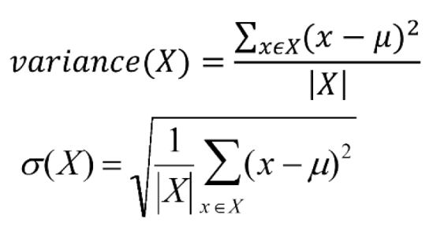
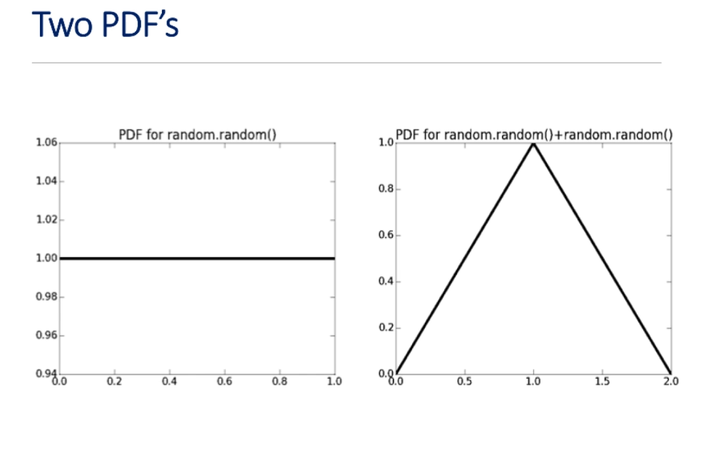
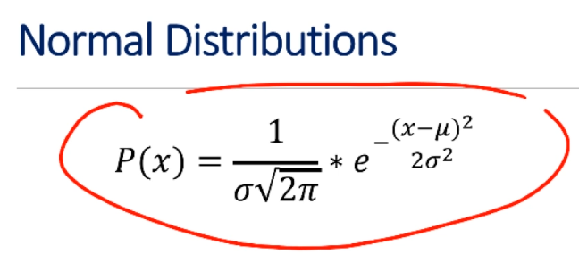
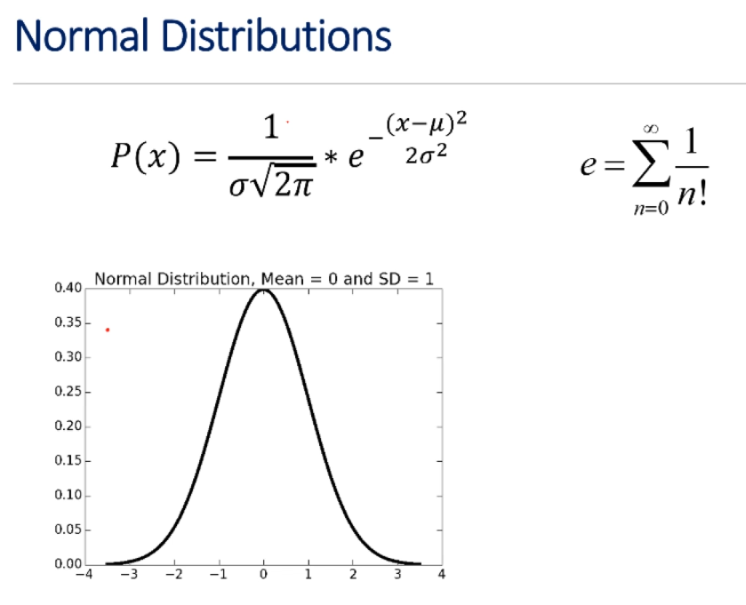
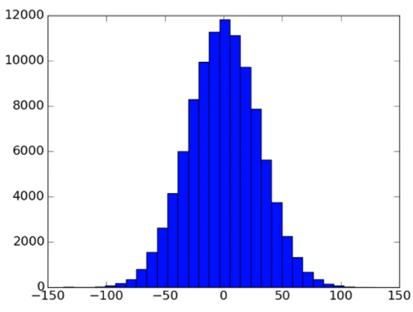
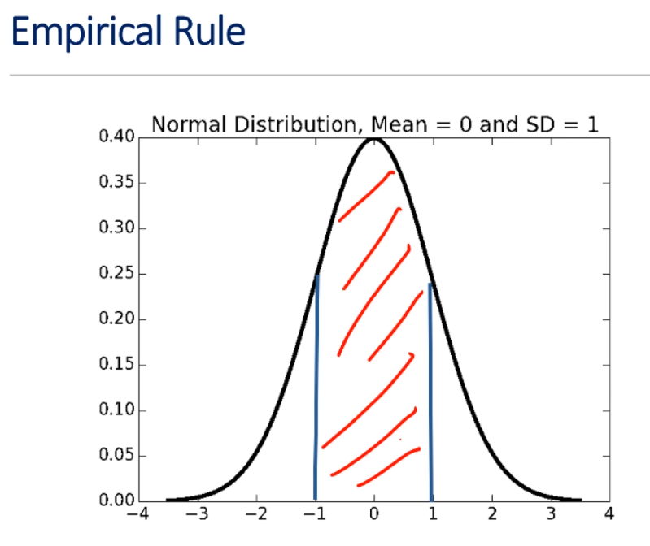

# Unit 3: Inferential Statistics And Probability

# Lecture 7: Inferential Statistics

## 3.1 Inferential Statistics

- ***Population***: a set of examples
- ***Sample***: a proper subset of a population
- **Goal**: estimate some statistic about the population based on stats about the sample
- **Key Fact**: if the sample is **random**, it tends to exhibit the same properties as the population from which it was drawn

---
### An Example
---

- given a single coinm estimate the fraction of heads you would get if you flipped the coin an infinite number of times
    - how confident would you be about answering 1.0?

- suppose we flipped the coin 1 time ...
    - how confident would we be in saying that the probability of heads is 1?
        - probably not very...
- suppose we flipped it 100 times ...
    - how confident would you be about predicting the next flip would be heads?
        - if the coin is fair, the probability of getting heads 100 times is very, very small
        - we might feel pretty safe in this case inferring that the coin is a heads on both sides

> your belief on whether the coin is fair or not is based on the intuition that the behavior of a sample of 100 flips is similar to the behavior of the population of **all** flips of your coin

- consider another situation in which we flip a coin 100 times and get 52 heads and 48 tails:
    - how comfortable would you feel in predicting that if you flipped it another 100 times, you'd get 52 heads? or even in predicting that there will be more heads than tails?
        - probably not very confident

- so why the difference in our confidence?

---
### Why The Difference In Confidence?
---

- confidence in our estimate depends upon two things:
    - size of sample (100 vs. 2)
    - variance of sample (all heads versus 52 heads)
- as the variance grows, we need larger samples to have the same degree of confidence

---
### Roulette
---

- can bet on a number (1 to 36)
- can bet on a color (red or black)

```python
import random

class FairRoulette():
    def __init__(self):
        self.pockets = []
        for i in range(1,37):
            self.pockets.append(i)
        self.ball = None
        self.blackOdds, self.redOdds = 1.0, 1.0
        self.pocketOdds = len(self.pockets) - 1.0

    def spin(self):
        self.ball = random.choice(self.pockets)

    def isBlack(self):
        if type(self.ball) != int:
            return False
        if ((self.ball > 0 and self.ball <= 10) or \
            (self.ball > 18 and self.ball <= 28)):
            return self.ball % 2 == 0
        else:
            return self.ball % 2 == 1
    def isRed(self):
        return type(self.ball) == int and not self.isBlack()

    def betBlack(self, amt):
        if self.isBlack():
            return amt * self.blackOdds
        else:
            return -amt
    def betRed(self, amt):
        if self.isRed():
            return amt * self.redOdds
        else:
            return -amt
    def betPocket(self, pocket, amt):
        if str(pocket) == str(self.ball):
            return amt * self.pocketOdds
        else:
            return -amt

    def __str__(self):
        return 'Fair Roulette'


def playRoulette(game, numSpins, toPrint=True):
    luckyNumber = '2'
    bet = 1
    totRed, totBlack, totPocket = 0.0, 0.0, 0.0
    
    for i in range(numSpins):
        game.spin()
        totRed = totRed + game.betRed(bet)
        totBlack = totBlack + game.betBlack(bet)
        totPocket = totPocket + game.betPocket(luckyNumber, bet)
    
    if toPrint:
        print(numSpins, 'spins of', game)
        print('Expected return of betting red =', str(100*totRed/numSpins) + '%')
        print('Expected return of betting black =', str(100*totBlack/numSpins) + '%')
        print('Expected return of betting', luckyNumber, '=', str(100*totRed/numSpins) + '%')

    return (totRed/numSpins, totBlack/numSpins, totPocket/numSpins)

##numSpins = 10000000
##game = FairRoulette()
##playRoulette(game, numSpins)
```

- notice the variation in expected return as the number of trials increases
- we very quickly notice that a low number of trials, like 100, is insufficient
    - this is why we typically structure our simulations to include multiple trials and look at the consistency of those results

---
### 10M Spins Of The Wheel
---

- when we do 10M spins, the range of returns is now pretty narrow
    - we know that we should be converging on 0 and we are

---
### Law Of Large Numbers
---

- aka Bernoulli's Law
- probably most important law in all of stats

- in repeated independent tests with the same actual probability *p* of a particular outcome in each test (i.e., net return of zero), the chance that the fraction of times that outcome occurs differs from *p* -- converges to 0 as the number of trials goes to infinity

- it's worth noting that the Law of Large Numbers **does not** imply, as too many seem to think, that if deviations from expected behavior occur, these deviations are likely to be evened out by opposite deviations in the future
    - this misapplication of the Law of Large Numbers is known as **gambler's fallacy**

---
### Gambler's Fallacy
---

- if deviations from expected behavior occur, these deviations are likely to be evened out by opposite deviations in the future

- great example:
    - August 18, 1913 at the Monte Carlo
    - roulette wheel came up black a record 26 times in a row
        - there was a panicked rush to bet on red, especially after the 15th or so black had come up

- probability of 15 consecutive reds is really low...
    - 1/32,378
- probability of 25 consecutive reds...
    - 1/33,554,432
- probability of 26 consecutive reds...
    - 1/67,108,865
- probability of 26 consecutive reds when provious 25 rolls were red...
    - 1/2

---
### Regression To The Mean
---

- following an extreme event, the next random event is likely to be less extreme
- if you spin a fair roulette wheel 10 times and get 100% reds, that is an extreme event (p=1/1024)
- it is likely that in the next 10 spins, you will get fewer than 10 reds
- so, if you look at the average of the 20 spins, it will be closer to the expected mean of 50% reds than to 100% you saw in the first 10 spins

- term regression to mean first used by Francis Galton in a paper titled "Regression Towards Mediocrity in Hereditary Stature"
    - Galton observed that the children of unusually tall parents were likely to be shorter than their parents

---
### Back To Roulette
---

- no casino on earth offers a fair roulette game
    - casino's are not in the business of being fair...
    - no casino wants to just break even...
- they use unfair roulette wheels
    - American roulette:
        - 2 extra numbers, 0 and 00
        - extra numbers are color green
    - European roulette:
        - single green 0

---

## 3.2 Variation In Data

```python
class EuRoulette(FairRoulette):
    def __init__(self):
        FairRoulette.__init__(self)
        self.pockets.append('0')
    def __str__(self)
        return 'European Roulette'

class AmRoulette(EuRoulette):
    def __init__(self):
        EuRoulette.__init__(self)
        self.pockets.append('00')
    def __str__(self):
        return 'American Roulette'

def findPocketReturn(game, numTrials, trialSize, toPrint):
    pocketReturns = []
    for t in range(numTrials):
        trialVals = playRoulette(game, trialSize, toPrint)
        pocketReturns.append(trialVals[2])
    return pocketReturns

random.seed(0)
numTrials = 20
resultDict = {}
games = (FairRoulette, EuRoulette, AmRoulette)
for G in games:
    resultDict[G().__str__()] = []
for numSpins in (100, 1000, 10000, 100000):
    print('\nSimulate betting a pocket for', numTrials, 'trials of', numSpins, 'spins each')
    for G in games:
        pocketReturns = findPocketReturn(G(), numTrials, numSpins, False)
        print('Exp. return  for', G(), '=', \
        str(100*sum(pocketReturns)/float(len(pocketReturns))) + '%')
    
def getMeanAndStd(X):
    mean = sum(X)/float(len(X))
    tot = 0.0
    for x in X:
        tot = tot + (x - mean)**2
    std = (tot/len(X))**0.5
    return mean, std
```

---
### Comparing Different Games
---
```python
Simulate betting a pocket for 20 trials of 100 spins each
Exp. return for FairRoulette = 22.4%
Exp. return for EuRoulette = -8.2%
Exp. return for AmRoulette = 4.4%


Simulate betting a pocket for 20 trials of 1000 spins each
Exp. return for FairRoulette = 3.68%
Exp. return for EuRoulette = -5.5%
Exp. return for AmRoulette = -4.24%

Simulate betting a pocket for 20 trials of 10000 spins each
Exp. return for FairRoulette = 0.998%
Exp. return for EuRoulette = -6.364%
Exp. return for AmRoulette = -4.582%

Simulate betting a pocket for 20 trials of 100000 spins each
Exp. return for FairRoulette = 0.125%
Exp. return for EuRoulette = -3.313%
Exp. return for AmRoulette = -5.5936%
```

---
### Sampling Space Of Possible Outcomes
---

- never possible to guarantee perfect accuracy through sampling
    - no matter how many samples we examine, we can never be sure that the sample set is typical until we examine every element of the population
        - since we're usually dealing with an infinite population, this is usually impossible
- not to say that an estimate cannot be precisely correct
- how many samples do we need to look at before we can have justifiable confidence in our answer?
    - depends upon variability in underlying distribution

---
### Quantifying Variation In Data
---


- standard deviation is simply the square root of the variance
- outliers can have a big effect as we're squaring them
- standard deviation should **always be considered relative to mean**

- mu is the average value of the sample
- for each element of the sample, we look at the difference between that element and the mean and we square it
    - sum that up and divide by the size of the sample
> think of this as **how far things differ from the mean** or **how frequently things differ from the mean**

- standard deviation, often written as sigma, is the square root of the variance
- informally, this tells us what fraction of the values are close to the mean
    - if many values are relatively *close to the mean*, the standard deviation is small
    - if many values are *far from the mean*, their standard deviation is large
    - if all values are the *same value*, then *all values will be the mean* and the standard deviation is 0
- notice how **all** of this, again, is in context of the **mean** -- you can never look at it in isolation

---
### For Those Who Prefer Code
---

```python
def getMeanAndStd(X):
    """
    Returns mean and standard deviation of a list or array, X
    """
    mean = sum(X)/float(len(X))
    tot = 0.0
    for x in X:
        tot = tot + (x - mean)**2
    std = (tot / len(X))**0.5
    return mean, std
```
---
### Confidence Levels And Intervals
---

- instead of estimating an unknown parameter by a single value (e.g., the mean set of trials), a confidence interval provides a range that is likely to contain the unknown value and a confidence that the unknown value lays within that range
- let's look at an example:
    - the return on betting on 2 twenty times in EuRoulette is -3.3%
    - the margin of error is +/-1 percentage point with a 95% level of confidence

> what this means is that if we were to conduct an infinite number of experiments of 20 spins of a wheel, in 95% of those experiments, my return would be between -2.3% and -4.3%

- together the confidence interval and the confidence level indicate the reliability of the estimate
- almost always, increasing the confidence level will widen the confidence interval

- so how can the confidence interval for a specific confidence level be calculated?
    - we can do it using the standard deviation of a set of trials
- under some assumptions that we'll get to later, we can apply something called the **empirical rule**


---
### Empirical Rule
---

- under some assumptions discussed later
    - ~68% of data within one standard deviation of mean
    - ~95% of data within 2 standard deviations of mean
    - ~99.7% of data within 3 standard deviations on mean

---
### Applying Empirical Rule
---

```python
numTrials = 20
resultDict = {}
games = (FairRoulette, EuRoulette, AmRoulette)
for G in games:
    resultDict[G().__str__()] = []
for numSpins in (100, 1000, 10000):
    print('\nSimulate betting a pocket for', numTrials, 'trials of', numSpins, 'spins each')
    for G in games:
        pocketReturns = findPocketReturns(G(), 20, numSpins, False)
        mean, std = getMeanAndStd(pocketReturns)
        resultDict[G().__str__()].append((numSpins, 100*mean, 100*std))

        print('Exp. return for', G(), '=', str(round(100*mean, 3)) + '%,', '+/-' + \
            str(round(100*1.96*std, 3)) + '% with 95% confidence')
```

---

## 3.3 Distributions

---
### Empirical Rule
---

- under some assumptions discussed later
    - ~68% of data within one standard deviation of mean
    - ~95% of data within 2 standard deviations of mean
    - ~99.7% of data within 3 standard deviations on mean

- two key assumptions:
    - the mean estimation error is 0
    - the distribution of the errors in the estimates is normal (Gaussian, i.e. bell curve)

---
### Defining Distributions
---

- use a probability distribution
- captures notion of relative frequency with which a random variable takes on certain values
    - discrete random variables drawn from finite set of values
    - continuous random variables drawn from reals between two numbers (i.e., infinite set of values)
- for discrete variable, simply list the probability of each value, must add up to 1
- continuous case trickier, can't enumerate probability for each of an infinite set of values

---
### PDFs
---

- distributions defined by **probability density functions** (PDFs)
- probability of a random variable lying between two values
- defines a curve where the values on the x-axis lie between minimum and maximum value of the variable
- area under curve between two points is the probability of example falling within that range



- for the first PDF, the area under the curve from 0 to 1 is **1**
    - we know that because we can multiply 1 by 1 and get 1
        - this makes sense as we know that the probability of `random.random` returning a value between 0 and 1 is indeed 1
    - the line is flat because all values are equally probable
        - if we consider the area under the curve between, say 0.2 and 0.4, we see that the value should be 1 times 0.2, or 0.2
            - this tells us the probability of of the value falling in this range

- the curve for `random.random() + random.random()` is more complicated -- some of the values are more probable than others
    - e.g., 1 is considerably more probable than 0
- this, by the way, is called a triangular distribution

---
### Normal Distributions
---



- mu is the mean
- sigma is the standard deviation
- e is Euler's number
    - ~2.718



- just remember that normal distributions peak at the mean and fall off symmetrically above and below the mean, asymptotically approach 0
    - technically, in a continuous normal distribution, 0 is never actually reached
- the other thing to remember is that a normal distribution can be specified by two parameters:
    - the mean
    - the standard deviation
- knowing these two values is equivalent to knowing the entire normal distribution
    - given those values and the equation we just looked at, you can produce the normal distribution itself

---
### Why We Like Normal Distributions
---

- nice mathematical properties
- occur **a lot**!
    - e.g., the measurement errors in many experiments are very close to normal
        - if we were to take the height and weights of everybody taking this course and plot them, the curve would be very close to normal
    - a little later, we'll see why they occur all the time

---
### Generating Normal Distributions
---

- it's nice to know that normal distributions can be easily generated in `pylab` 

```python
dist = []
for i in range(100000)
    dist.append(random.gauss(0, 30))
pylab.hist(dist, 30)
```



- `random.gauss` gives one a random number, drawn from a normal distribution
    - mean in this case is 0 and standard deviation is 30 -- mu and sigma

- so this little piece of code let's us create a discrete approximation to a normal distribution with 100,000 values plotted into 30 bins
    - the peak is indeed at mu
        - falls off very close to symmetrically around the peak
            - this is not perfectly symmetrical, of course, as we would need to produce a number of points approaching infinity to get a real normal distribution

- so why are we looking at normal distributions?
    - let's go back to confidence intervals and the empirical rule

---
### Empirical Rule
---



- if you look to the area between the blue lines, one standard deviation on either side of the mean, it's pretty easy to imagine that this would be roughly 68% of the area under the whole curve

- we can write some code to confirm this visualization, but since writing that code require integration, we're going to digress for a moment

---
### A Digression
---

- `scipy` library contains many useful mathematical functions used by scientists and engineers
- `scipy.integrate.quad` (quadrature method for doing integration) has up to four arguments:
    - a function or method to be integrated
    - a number representing the lower limit of the integration
    - a number representing the upper limit of the integration
    - an optional tuple supplying the values for all arguments, except the first, of the function to be integrated

- `scipy.integrate.quad` returns a tuple
    - **approximation** to result
        - this is a numerical estimate of the integral
        - it's not an exact calculation because you can give it a function that isn't very well behaved and it will approximate the result (later in the course, we'll see how it might work)
    - estimate of absolute error of the approximation

---
### Checking Empirical Rule
---

```python
import scipy.integrate

def gaussian(x, mu, sigma):
    factor1 = (1.0/(sigma*((2*pylab.pi)**0.5)))
    factor2 = pylab.e**-(((x-mu)**2)/(2*sigma**2))
    
    return factor1 * factor2

def checkEmpirical(numTrials):
    """
    Computes the area under portions of the normal distributions for some randomly chosen means and standard deviations
    """
    for t in range(numTrials):
        mu = random.randint(-10, 10)
        sigma = random.randint(1, 10)
        print('For mu = ', mu, 'and sigma =', sigma)
        for numStd in (1, 1.96, 3):
            area = scipy.integrate.quad(guassian, mu-numStd*sigma, mu_numStd*sigma, (mu, sigma))[0]
            print(' Fraction within', numStd, 'std =', round(area, 4))
```

- the empirical rule **really works** for normal distributions

---
### But Not All Distributions Are Normal
---

- are the outcomes of a roulette wheel normally distributed?
    - no, they'ew **uniformly distributed** as each outcome is equally probable
- so why does the empirical rule work for us when calculating the confidence intervals for the expected return of various bets?
    - it's curious, and we'll find out in the next lecture

---