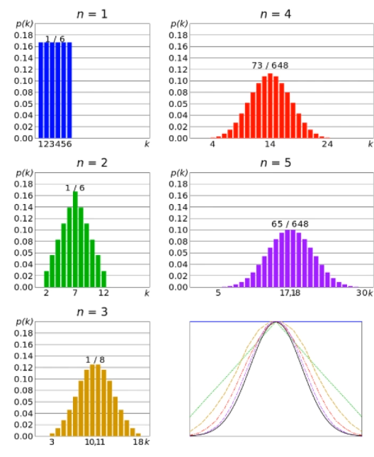
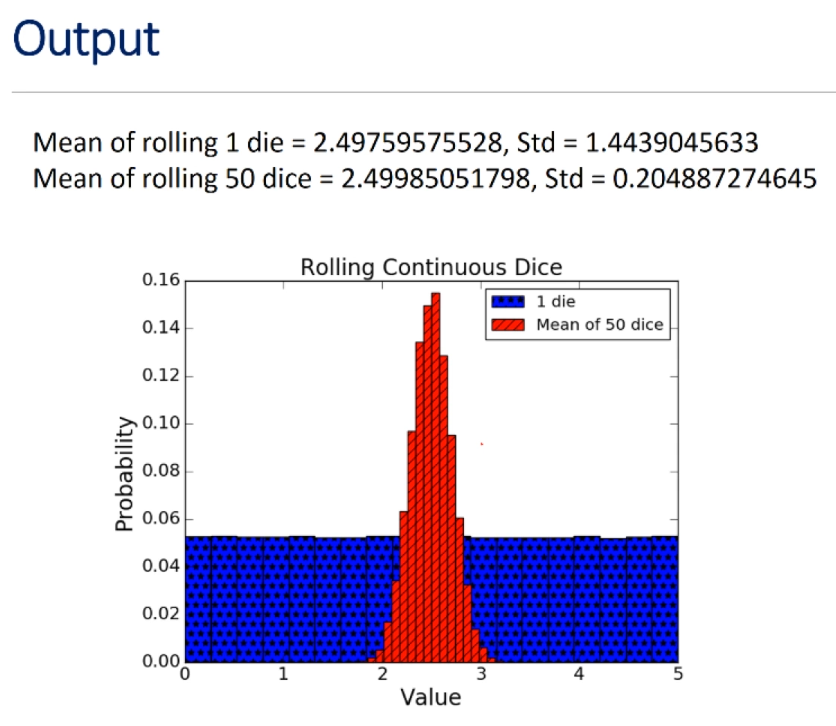
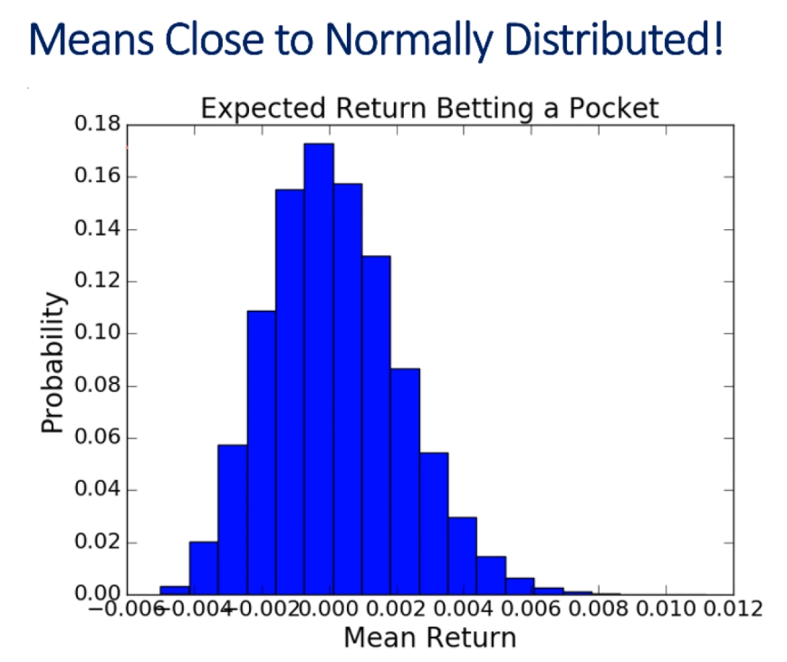
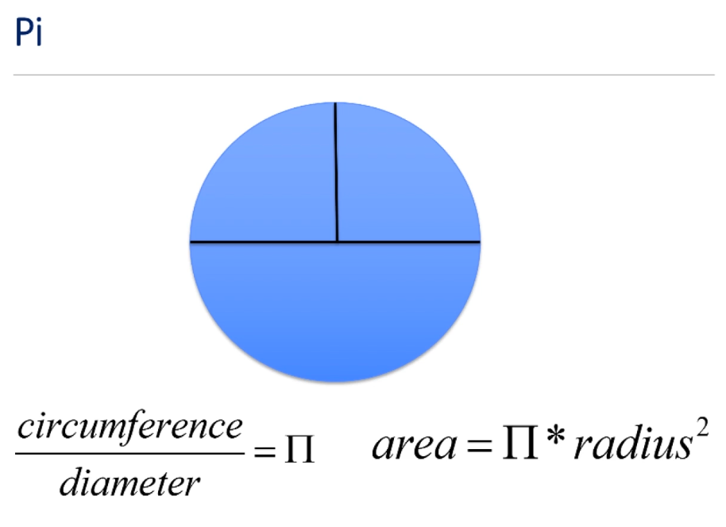
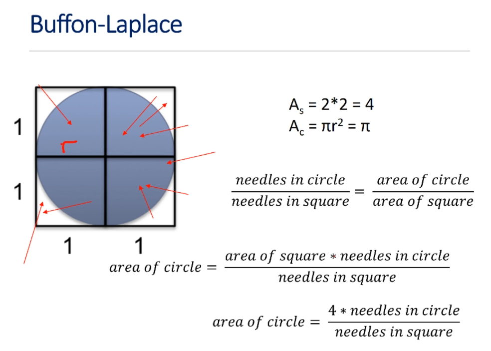
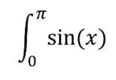
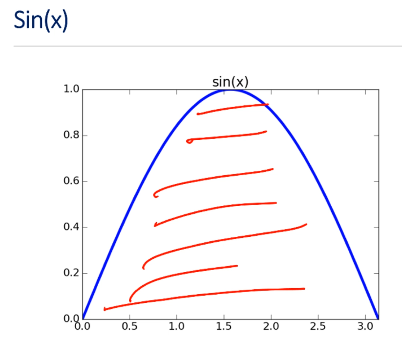

# Unit 3: Inferential Statistics And Probability

# Lecture 8: Monte Carlo Simulations

## 3.3 Central Limit Theorem

---
### Why Did The Empirical Rule Work?
---

- because we are not reasoning about a single spin, but about the mean of a set of spins
- and the central limit theorem applies
    - CLT is one of the two most important theorems in all of probability and stats
        - we've already seen the other, the law of large numbers



---
### Central Limit Theorem (CLT)
---

- given a sufficiently large sample:
    1) the means of the samples in a set of samples (the sample means) will be approximately normally distributed
    2) this normal distribution will have a mean close to the mean of the population
    3) the variance of the sample means will be close to the the variance of the population divided by the sample size

---
### Checking CLT
---

```python
def plotMeans(numDice, numRolls, numBins, legend, color, style):
    means = []
    for i in range(numRolls//numDice):
        vals = 0
        for j in range(numDice):
            vals = vals + 5*random.random()
        means.append(vals/float(numDice))
    pylab.hist(means, numBins, color=color, label=legend, weights=pylab.array(len(means)*[1])/len(means), hatch=style)
    return getMeanAndStd(means)

mean, std = plotMeans(1, 100000, 19, '1 die', 'b', '*')
print('Mean of rolling 1 die =', str(mean) + ',', 'Std =', std)

mean, std = plotMeans(50, 100000, 19, 'Mean of 50 dice', 'r', '//')
print('Mean of rolling 50 dice =', str(mean) + ',', 'Std =', std)

pylab.title('Rolling Continuous Dice')
pylab.xlabel('Value')
pylab.ylabel('Probability')
pylab.legend()    
```
- Imagine that you had a die with a property that each role would yield a random real number between 0 and 5
    - miraculous continuous die
- the code here simulates rolling a single die many times and prints the mean and variance and then plots a histogram showing the probabiltiy of ranges of numbers getting rolled
- it then simulates rolling 50 dice many times and plots on the same figure as the first histogram a histogram of the mean values of those 50 dice

- this is something we've yet to see in `pylab.hist`, the keyword `weights`
    - in the usual histogram, the size of each bin is determined solely by the number of elements contained in that bin
        - here, we're doing something different because we want to see something different
            - we don't want to see the number of elements, we want each bin to show the probability of the mean falling within that bin
            - so how do we do this?
                - use the `weights` keyword, which is bound to an array of the same length as the first argument to hist, and is used to assign a weight to each element in that first argument
                - because of this, in the resulting histogram, each value in a bin contributes its associated weight towards the bin count instead of the usual one
    - in this example, we use `weights` to scale the y-values to the relative rather than the absolute size of each bin
        - therefore, for each bin, the value on the y-axis is the probability of the mean falling within that bin rather than the number of elements that fell within that bin
        - we're taking the histogram and plotting it differently so that we're now scaled to probabilities rather than to absolute counts

---
### Checking CLT
---

```python
def plotMeans(numDice, numRolls, numBins, legend, color, style):
    means = []
    for i in range(numRolls//numDice):
        vals = 0
        for j in range(numDice):
            vals = vals + 5*random.random() 
        means.append(vals/float(numDice))
    pylab.hist(means, numBins, color=color, label=legend, weights=pylab.array(len(means)*[1])/len(means), hatch=style)
    return getMeanAndStd(means)

mean, std = plotMeans(1, 100000, 19, '1 die', 'b', '*')
print('Mean of rolling 1 die =', str(mean) + ',', 'Std =', std)

mean, std = plotMeans(50, 100000, 19, 'Mean of 50 dice', 'r', '//')
print('Mean of rolling 50 dice =', str(mean) + ',', 'Std =', std)

pylab.title('Rolling Continuous Dice')
pylab.xlabel('Value')
pylab.ylabel('Probability')
pylab.legend()
```

- `hatch` keyword argument is used so that we can visually distinguish one histogram from another



- when we look at the average value of 50 dice, you see that the distribution of the sample means is pretty close to normal with the peak including the expected mean
    - we can also see that the standard deviation is much lower
        - in fact, if we look at this carefully,  we'll see that the variance of the mean of 50 rolls is close to the variance of a single roll divided by 50 -- all as is predicted by CLT

---
### Try It For Roulette
---

```python
numTrials = 50000
numSpins = 200
game = FairRoulette()

means = []
for i in range(numTrials):
    means.append(findPocketReturn(game, 1, numSpins)[0] / numSpins)

pylab.hist(means, bins=19, weights=pylab.array(len(means) * [1]) / len(means))
pylab.xlabel('Mean Return')
pylab.ylabel('Probability')
pylab.title('Expected Return Betting A Pocket')
```



- of course, this isn't quite normally distributed, but again, whenever we do a finite number of trials, which is all we can ever do, we shouldn't expect to get a perfect normal distribution
- notice also that the mean, as expected, peaks around 0, which is what we think the return should be on a fair roulette
- so what's the moral?
    - it's an important one

---
### Moral
---

- it doesn't matter what the shape of the distribution of values happens to be...
    - **if** what we are trying to estimate is something about the mean of the population **and** we're doing it with sufficiently large samples

- why doesn't it matter?
    - CLT allows us to use the empirical rule whenever we're estimating confidence intervals for means
        - this is a pretty wonderful thing, as we'll see

---

## 3.4 Simulation To Find Pi

- the term **Monte Carlo siumlation** was coined in 1949 by Stanislaw Ulam and Nicholas Metropolis in homage to games of chance played in the Monte Carlo Casino
    - Ulam invented the Monte Carlo method in 1946
        - wanted to know the probability of a Canfield solitaire game laid  out with 52 cards coming out successfully
            - tried to find an answer with combinatorial calculations, but then thought about a more abstract approach in just playing 100 games and observing the count of successful plays
            - thought of neutron diffusion among other questions of mathematical physics, and more generally how to change processes described by certain differential equations into an equivalent form interpretable as a succession of random operations
            
---
### We've Been Doing This Already
---

- a method of estimating the value of an unknown quantity using the principles of inferential statistics
- **inferential statistics**
    - **population**: a set of examples
    - **sample**: a proper subset of a population
    - key fact: a **random sample** tends to exhibit the same properties as the population from which it is drawn

- it's easy to see how Monte Carlo simulations is useful for tackling problems in which predictive non-determinism plays a role
- amazingly, however, Monte Carlo simulation, and randomized algorithms in general for that matter, can be used to solve problems that have nothing inherently stochastic in them
    - i.e., for which there is no uncertainty about the outcomes

Let's look at an example.  

---
### Pi
---



---
### Buffon-Laplace
---

- French mathematicians Buffon and Laplace proposed using a stochastic simulation, which we would now call a Monte Carlo simulation, to estimate the value of pi
    - think about inscribing a circle in a square where the two sides of the square are of length 2
    - that implies that the radius, r, is of length 1
    - we know the area of the square is 2 x 2 = 4
    - by definition, the area of a circle is `(pi*r)**2`
        - since `r` is 1, that means that the area of the circle is exactly equal to `pi`
            - if we know the area of the circle, we know the value of pi
- Buffon's idea was that we could estimate the area of the circleby dropping a large number of needles, which he argued would follow a random path as they fell in the vicinity of the square
    - then the ratio of the number of needles with tips lying within the circle could be used to estimate the area of the circle; the needles in the circle divided by the by the needles in the square should be the same as the circle divided by the the area of the square



- if we take this equation and solve for the area of the circle, we see that the area of the circle is now the ratio of the area of the square times the number of needles in the circle to the needles in the square
- solving this further, we know that the area of the of the square is 4, so we get the last equation
    - since we know that the area of this circle is `pi`, we can now compute by just counting up the needles

---

## 3.5 Monte Carlo Simulations

---
### Simulating Buffon-Laplace Method
---

```python
def throwNeedles(numNeedles):
    inCircle = 0
    for Needles in range(1, numNeedles + 1, 1):
        x = random.random()
        y = random.random()
        if (x*x + y*y)**0.5 <= 1.0:
            inCircle = inCircle + 1
    return 4*(inCircle/float(numNeedles))   # remember the 4 comes from the area of the square!
```

- gets a pair of positive Cartesian coordinates, the `x` and `y` values, and uses the Pythagorean theorem to compute the hypotenuse of the right triangle with base `x` and height `y`, which happens to be the distance of the tip of the needle from the origin
- since the radius of the circle is 1, we know that the needles lies within the circle if and only if the distance from the origin is no greater than 1
    - we can use this fact to count the number of needles in the circle

```python
def getEst(numNeedles, numTrials):
    """
    Uses throwNeedles function to find an estimate of pi by dropping numNeedles and averaging the result over numTrials trials
    """
    estimates = []
    for t in range(numTrials):
        piGuess = throwNeedles(numNeedles)
        estimates.append(piGues)
    sDev = stdDev(estimates)
    curEst = sum(estimates)/len(estimates)
    print('Est. = ' + str(curEst) + \
        ', Std dev. = ' + str(round(sDev, 6)) + \ 
        ', Needles = ' + str(numNeedles))
    return (curEst, sDev)

def estPi(precision, numTrials):
    numNeedles = 1000
    sDev = precision
    while sDev >= precision / 2:
        curEst, sDev = getEst(numNeedles, numTrials)
        numNeedles = numNeedles * 2
    return curEst
```

- the function `estPi` calls `getEst` with an ever-growing number of needles until `getEst` returns an estimate that, with a confidence of 95%, is within precision of the actual values
- it does this by calling `throwNeedles` with an ever larger number of needles until the standard deviation of the results of `numTrials` is no larger than the desired precision divided by 1.96
- under the valid assumption -- we know it's valid because of the CLT -- that the errors are normally distributed, this implies that 95% of the values lie within the precision of the mean
    - this approach, while quite common, is something we haven't seen before
    - previously, we just sort of pulled out of whole cloth the number of trials and the size of each trial.
        - here we're doing something different:
            - this is a really not great thing about simulations.
            - you run a simulation, and if you don't have enough confidence in the result because the standard deviation is, say, too big, you just run a bigger simulation
            - you do that until you're happy with the result
                - here, we're doubling the size of the simulation each time

---
### Being Right Is Not Good Enough
---

- not sufficient to produce a good answer
- need to have a reason to believe that it is close to right
- in this case, small standard deviation implies that we are close to the true value of `pi`

---
### Is It Correct To State ...
---

- 95% of the time we run this simulation, we will estimate that the value of `pi` is between 3.13473875875 and 3.14567467875?
- with a probability of 0.95, the actual value of `pi` is between 3.13744875875 and 3.14567467875?
- both are factually correct
- but only one of these statements can be inferred from our simulation

- having a small standard deviation is a **necessary condition** for having confidence in the validity of the result -- it is not a sufficient condition
- we have to always keep in mind that the notion of a statistically valid conclusion should never be confused with the notion of a correct conclusion
- each statistical analysis starts with a set of assumptions
    - the key assumption we made here is that our simulation is an accurate model of reality
    - whenever possible, we should attempt to validate results against reality

---
### Generally Useful Technique
---

- to estimate the area of some region, R:
    - pick an enclosing region, E, such that the area of E is easy to calculate and R lies completely within E
    - pick a set of random points that lie within E
    - let F be the fraction of the points that fall within R
    - multiply the area of E by F
- way to estimate integrals
- for example:





---