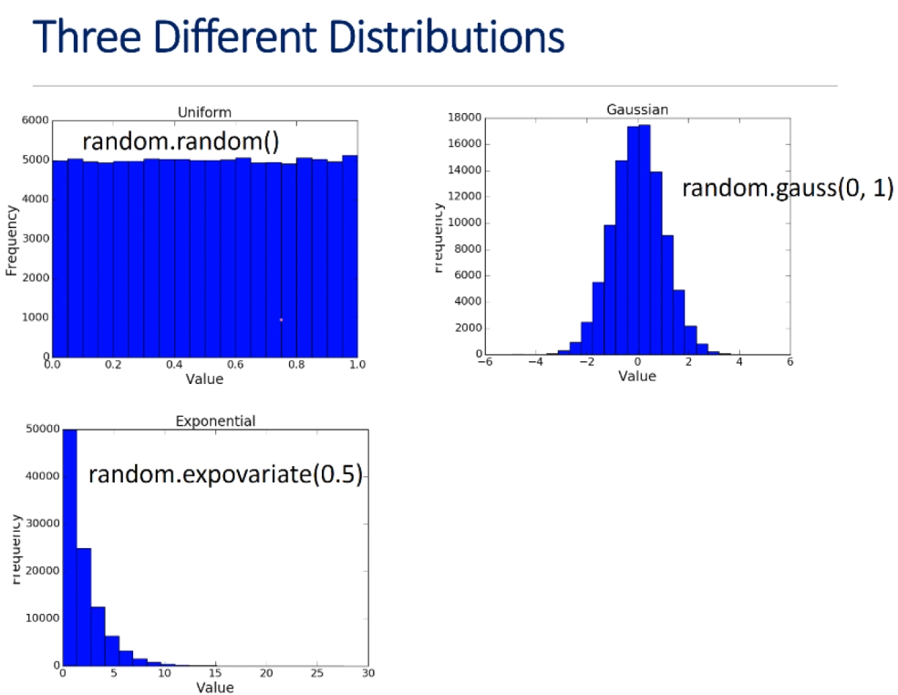
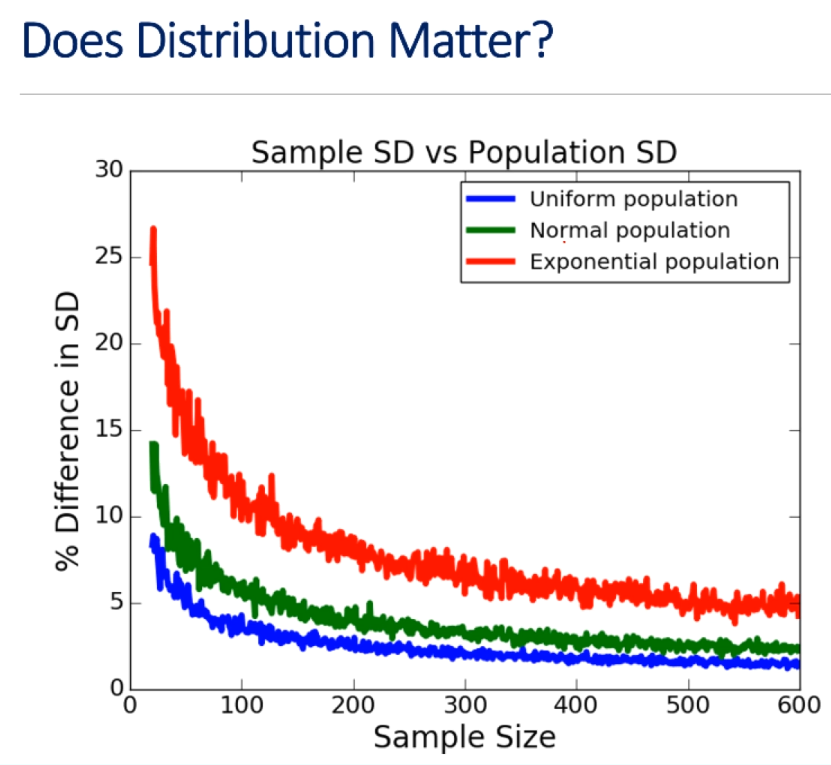

# Unit 3: Inferential Statistics And Probability

# Lecture 9: Sampling And Standard Error 

## 3.6 Data Sampling

---
### Recall Inferential Statistics
---

- inferential statistics: making inferences about a population by examining one or more random samples drawn from that population
- with Monte Carlo simulation, we can generate lots of random samples, using them to compute confidence intervals
- but suppose we can't create samples by simulation?
    - "According to the most recent poll, Clinton leads Trump by 3.7 percentage points in swing states; the registered voter sample is 835 with a margin of error +/-4 percentage points"
        - the 4% is intended to be something close to a 95% confidence interval
            - but it's clear that the polling organization did not conduct repeated polls of 835 people; instead they conducted one poll
        - how are they able to compute a confidence interval using only a single sample?

---
### Probability Sampling
---

- each member of the population has a non-zero probability of being included in a sample
- simple random sampling: each member has an equal chance of being chosen
- not always appropriate

- we should point out that simple random sampling is not always the best way to go, even when done properly
    - imagine we're conducting a poll to find out whether students at MIT are happy with their majors, and we decide to survey 100 students, about 3% of the total population of non-freshman


- as this chart shows, there's a significant skew in the majors
- this means that a simple random sample could easily underrepresent the smaller schools, perhaps leading us to make fallacious assumptions about the population
- in such situations, we need to use **stratified sampling**
    - in stratified sampling, we partition the entire population into subgroups and then take a random sample from each subgroup proportional to the relative size of that subgroup

---
### Stratified Sampling
---

- when there are small subgroups that should be represented
- when it is important that subgroups be represented proportionally to their size in the population
- can be used to reduce the needed size of sample
    - variability of subgroups less than of entire population
- requires care to do properly
- we'll stick to simple random samples in this course

---
### Predicting Outcome Of An Election
---

- approaches:
    - ask every voter
    - draw multiple random samples and compute mean and confidence interval
    - draw one sample and estimate the mean weight and confidence interval using that

- can't actually ask every voter, so there's no obvious way to evaluate sampling techniques
    - so for now, we're not going to look at polls as an example
        - instead, we're going to look at an example where we can easily get ground truth

---
### Predicting Temperatures In The U.S.
---


- shown here is a heat map, which tell us the maximum air temps at various places in the United States
    - as you can see, there are regions that are considerably chillier than others

---
### Data
---

- from U.S. National Centers for Environmental Information (NCEI)
- daily high and low temps for:
    - 21 different cities
        - roughly spread out to cover the entire geographic region
    - 1961-2015
    - 421,848 data points (examples)

```python
def makeHist(data, title, xlabel, ylabel, bins=20):
    pylab.hist(data, bins=bins)
    pylab.title(title)
    pylab.xlabel(xlabel)
    pylab.ylabel(ylabel)

def getHighs():
    inFile = open('temperatures.csv')
    population = []
    for l in inFile:
        try:
            tempC = float(l.split(',')[1])
            population.append(tempC)
        except:
            continue
    return population

def getMeansAndSDs(population, sample, verbose=False):
    popMean = sum(population) / len(population)
    sampleMean = sum(sample) / len(sample)
    if verbose:
        makeHist(population, \
                'Daily High 1961-2015, Population\n' + \
                '(mean = ' + str(round(popMean, 2)) + ')', \
                'Degrees C', 'Number Days')

        pylab.figure()
        makeHist(sample, \
                'Daily High 1961-2015, Sample\n' + \
                '(mean = ' + str(round(popMean, 2)) + ')', \
                'Degrees C', 'Number Days')

        print('Population mean =', popMean)
        print('Standard deviation =', numpy.std(population))
        print('Sample mean =', sampleMean)
        print('Standard deviation of sample =', numpy.std(sample))

    return popMean, sampleMean, numpy.std(population), numpy.std(sample)

    random.seed(0)
    population = getHighs()
    sample = random.sample(population, 100)
    getMeansAndSDs(population, sample, True)
```

---
### To Notice In The Code
---

- function `makeHist` there because we expect to make a lot of histograms and we want to be able to do so in a single line of code
- `numpy.std` is a function in the `numpy` module that returns the standard deviation
- `random.sample(population, sampleSize)` returns a list containing `sampleSize` randomly chosen distinct elements of `population`
    - i.e., we're extracting a sample from the population
    - notice that it's sampling without replacement
        - `random.sample` is what's enabling us to do this


- the distribution in not normal
- among other things, there's a long tail of cold temps on the left
- notice that the standard deviation is **enormous** -- about 58% of the mean
    - why is it so large relative to the mean?
        - first of all, we have a lot of places sampled here
        - the variability in the weather across these locations is pretty high
        - even in a single location, the weather can vary quite a bit seasonally or year-to-year
- for now, we'll smoosh everything together and focus on the mean temp


- this is even further from a normal distribution
- seem to be outliers

---
### Means And Standard Deviations
---

- Population mean = 16.3
- Sample mean = 17.1
- Standard deviation of population = 9.44
- Standard deviation of sample = 10.4

- a happy accident? or something we should come to expect?

---

## 3.7 Sample Sizes

let's answer the question we posed at the end of the last segment with a computational experiment  

- we'll try it 1000 times and plot the results

```python
random.seed(0)
population = getHighs()
sampleSize = 100
numSamples = 1000
maxMeanDiff = 0
maxSDDiff = 0
sampleMeans = []
for i in range(numSamples):
    sample = random.sample(population, sampleSize)
    popMean, sampleMean, popSD, sampleSD = getMeansAndSDs(population, sample, verbose=False)
    sampleMeans.append(sampleMean)

    if abs(popMean - sampleMean) > maxMeanDiff:
        maxMeanDiff = abs(popMean - sampleMean)
    
    if abs(popSD - sampleSD) > maxSDDiff:
        maxSDDiff = abs(popSD - sampleSD)

print('Mean of sample means =', \
        round(sum(sampleMeans) / len(sampleMeans), 3))
print('Standard deviation of sample means =', \
        round(numpy.std(sampleMeans), 3))
print('Maximum difference in means =', \
        round(maxMeanDiff, 3))
print('Maximum difference in standard deviations =', \
        round(maxSDDiff, 3))

makeHist(sampleMeans, 'Means of Samples', 'Mean', 'Frequency')
pylab.axvline(x=popMean, color='r')
```

- at the beginning, all we're doing is getting the population, sampling it, and doing some printing where we talk about the means of the samples and the population
- `pylab.avxline` draws a vertical red line (r because we specified the arg `r`) at the population mean on the x-axis
    - if we wanted to do a horizontal line, we could use an 'h' in place of the 'x'


- first thing we notice is that it's pretty close to normal -- why is this?
    - CLT, of course
- how about the 95% confidence interval?
    - we know the standard deviation, so we can compute the 95% confidence interval
        - with 95% confidence, we believe that the mean is within that range

- now, this is a pretty wide confidence interval
- suppose we want a tighter bound
    - how do we do that?

---
### Getting A Tighter Bound
---

- will drawing more samples help?
    - let's try increasing from 1000 to 2000
- how about larger samples?

- let's produce a plot that shows something called the **error bars** associated with various sample sizes
    - let's digress a bit and talk about error bars

---
### Error Bars
---

- graphical representation of the variability of data
- way to visualize uncertainty


- can be parallel to x-axis **OR** y-axis (usually to y-axis, though)
- here, for example, we used error bars to show the 95% confidence interval on a plot designed to represent the relationship between frequency of exercise and resting heartbeat

- when confidence levels **don't overlap**, we can condclude that **means are statistically significantly different at 95% level**
    - we can't by the way, conclude that they're **not** different just because they do overlap

---
### Key Line Of Code
---

- we can easily produce error bars using `pylab`'s error bar function:

```python
pylab.errorbar(xVals, sizeMeans, yerr=1.96*pylab.array(sizeSDs, fmt='o', label='95% Confidence Interval'))
```


- notice that the size of the error bars gets consistently smaller

---
### Bigger Seems To Be Better
---

- going from a sample size of 100 to 400 reduced the confidence interval from 1.8C to about 1C
- but we are now looking at 400,000 samples!
    - what has sampling bought us?
    - absolutely nothing!
        - we might as well have looked at the whole population, which was only slightly over 400,000

- SO, the real question is not what we can conclude by looking at lots of samples, but rather what *can* we conclude from looking at one reasonably small sample?
    - this answer to this is...more than you might think, as we'll see shortly

---

## 3.8 Standard Error

So, what can we conclude from 1 sample?  
- more than you might think
    - thanks to the Central Limit Theorem!

---
### Recall CLT
---

- given a sufficiently large sample:
    1) the means of the samples in a set of samples (the sample means) will be approximately normally distributed
    2) this normal distribution will have a mean close to the mean of the population
    3) the variance of the sample means will be close to the the variance of the population divided by the sample size
        - since we can get standard deviation out of the variance, we can conclude that the standard deviation of the sample should be close to the standard deviation of the population
            - we can use this fact to derive **SEM**

- time to use the third feature
- compute the *standard error of the mean* (**SEM** or **SE**) 
    - think of this as an estimate of the standard deviation of the sample


- the formula for computing standard error is remarkably simple
    - take standard deviation of the population, divide it by the square root of the size of the sample
- it's simple, but does it work?

---
### Testing The SEM
---

```python
sampleSizes = (25, 50, 100, 200, 300, 400, 500, 600)
numTrials = 50
population = getHighs()
popSD = numpy.std(population)
sems = []
sampleSDs = []
for size in sampleSizes:
    sems.append(sem(popSD, size))
    means = []
    for t in range(numTrials):
        sample = random.sample(population, size)
        means.append(sum(sample) / len(sample))
    sampleSDs.append(numpy.std(means))
pylab.plot(sampleSizes, sampleSDs, label='Std of 50 means')
pylab.plot(sampleSizes, sems, 'r--', label='SEM')
pylab.title('SEM vs. SD for 50 Means')
pylab.legend()
```

- we're going to look at a bunch of sample sizes ranging from 25 to 600
    - we'll do 50 trials of each sample size
    - based on those 50 trials, we can actually generate a true standard deviation
        - then we can compute the mean standard error to the actual standard deviations


- as we can see, the standard deviation of the mean, the red dotted line, tracks the standard deviation of the 50 means remarkably well
    - there's a catch:
        - we don't know the standard deviation of the population

- since the whole point of this exercise is not to look at the population but only at a single sample, how could we know the standard deviation of the population?
    - we can't...
- now we have to say:
    - given a single sample, how can we estimate the standard deviation of the population?
        - we've been estimating the mean by just taking the mean of the sample
            - maybe our best guess of the standard deviation of the population is the standard deviation of the mean
            - let's see how good that guess is for a population of temps


- as you can see, it's not so good for small samples
- as we get to larger samples, it really is much better
    - so maybe we can use the sample standard deviation, rather than the population standard deviation, to get an estimate of the standard error

---
### The Point
---

- once sample reaches a reasonable size, sample standard deviation is a pretty good approximation to population standard deviation
- to be responsible, we should ask whether this is true in general or whether it's just happening to work for this one example
    - we can explore that question by looking at two things
        1) distribution of the population?
            - does it matter whether it's normal or uniform or something else?
        2) size of population?
            - do we need to take larger samples, for example, when the population is larger?

- let's look at distributions first...

---
### Three Different Distributions
---



- the first two have some symmetry in contrast to the last, which is anything but symmetric around the mean
    - **skew** is a measure of the asymmetry of a probability distribution

---
### Looking At Distributions
---

```python
def plotDistributions():
    uniform, normal, exp = [], [], []
    for i in range(100000):
        uniform.append(random.random())
        normal.append(random.gauss(0, 1))
        exp.append(random.expovariate(0.5))

    makeHist(uniform, 'Uniform', 'Value', 'Frequency')
    pylab.figure()
    makeHist(uniform, 'Gaussian', 'Value', 'Frequency')
    pylab.figure()
    makeHist(uniform, 'Exponential', 'Value', 'Frequency')
    pylab.figure()

##plotDistributions()

def compareDists():
    uniform, normal, exp = [], [], []
    for i in range(100000):
        uniform.append(random.random())
        normal.append(random.gauss(0, 1))
        exp.append(random.expovariate(0.5))
    sampleSizes = range(20, 600, 1)
    udiffs = getDiffs(uniform, sampleSizes)
    ndiffs = getDiffs(normal, sampleSizes)
    ediffs = getDiffs(exp, sampleSizes)
    
    plotDiffs(sampleSizes, udiffs, \
            'Sample SD vs. Population SD', 'Uniform population')
    plotDiffs(sampleSizes, ndiffs, \
            'Sample SD vs. Population SD', 'Normal population')
    plotDiffs(sampleSizes, ediffs, \
            'Sample SD vs. Population SD', 'Exponential population')

compareDists()
```



- apparently, the distribution does matter
    - we see that the trend is the same
        - the larger the sample size, the closer of the two standard deviations get
    - but it starts much lower and drops much faster on **for the two distributions with small skew**
    - for the distribution with large skew, even when we get to, say 200, the difference is still around 10%
        - what we see here is when we're choosing our sample size, **we do have to worry about the skew in the population**
        - the good news, though, is that size of the population doesn't matter so much...


- this is great news, because it tells us that, even if we want to learn something about a population of millions -- say, how is the U.S. going to vote in the next election? -- we can sample a few thousand and get a really good estimate

---
### Estimate Mean From A Single Sample
---

1) choose sample size based on estimate of skew in population
2) choose a random sample from the population
3) compute the mean and standard deviation of that sample
4) use standard deviation of sample to estimate the SE
5) use the estimated SE to generate confidence intervals around the sample mean

- all of this works great when we choose independent random samples!
- not always so easy to do

---

## 3.8 Independent Random Samples

---
### Are 200 Samples Enough?
---

```python
temps = getHighs()
popMean = sum(temps) / len(temps)
sampleSize = 200
numTrials = 10000
numBad = 0
for t in range(numTrials):
    sample = random.sample(temps, sampleSize)
    sampleMean = sum(sample) / sampleSize
    se = numpy.std(sample) / sampleSize**0.5
    if abs(popMean - sampleMean) > 1.96*se:
        numBad = numBad + 1
print('Fraction outside 95% confidence interval =', numBad/numTrials)
```

- runs 10,000 trials of 200 samples each
- for each trial, it computes a sample mean and a standard deviation
    - it then uses the size of the sample and the standard deviation of the sample to compute an approximation to the SE
    - finally, it checks whether the sample mean falls within 1.96 standard errors of the population
        - if not, increments the number of "bad samples" by 1
    - after conducting the trials, prints the fraction of samples that were bad
        - that is to say, the fraction of samples that means more than 1.96 standard errors from the population mean

- the result of running this code, unsurprisingly, is a 5% fraction outside the 95% confidence interval
    - hurrah for CLT!

- let's look at another example where we **don't sample properly** by changing the way we draw our samples:

```python
for t in range(numTrials):
    posStartingPts = range(0, len(temps) - sampleSize)
    start = random.choice(posStartingPts)
    sample = temps[start:start+sampleSize]
    sampleMean = sum(sample) / sampleSize
    se = numpy.std(sample) / sampleSize**0.5
    if abs(popMean - sampleMean) > 1.96*se:
        numBad = numBad + 1
print('Fraction outside 95% confidence interval =', numBad/numTrials)
```

- by comparison, this method of sampling gives us a fraction outside the confidence interval of almost 94%
- what's going on?

---
### Has Theory Failed Us?
---

- no, but we have failed the theory
    - we violated a key assumption
        - we did not choose independent random samples
            - as it happens, the data in our `.csv` file is organized by city
                - the temperatures are correlated by cities
            - therefore, examples in sample are not independent of each other
            - obvious here, but can be subtle in different problems
- **all theoretical results incorporate some assumptions**
    - these *must* be checked before applying the theory!
    - the failure to check these kinds of assumptions lies at the root of many, many bad statistical conclusions

---