# Unit 4: Understanding Experimental Data

# Lecture 10: Experimental Data Pt. 1

## 4.1 Experimental Data

We live in a data intensive world.  

Scientists, engineers, social scientists, financial workers,managers of sports teams, all spend an increasingly large fraction of their time trying to understand data.  

And they, or someone they work with, inevitably ends up producing software to help with that process.

Much of 600.2x is designed to help you understand **what one can try to do with such software** and, most importantly, **how to get a sense of whether you should believe the answers**

---
### Statistics Meets Experimental Data
---

- conduct an experiment to gather data
    - physical (e.g. in a biology lab)
    - social (e.g., questionnaires)
    - often what we do is scrape our data off the web or borrow someone else's data

- use theory to generate some questions about the data
    - physical (e.g., gravitational fields)
    - social (e.g., people give inconsistent answers)

- **design a computation to help *answer questions* about data**

---
### This Kind Of Spring
---

- linear spring: amount of force needed to stretch or compress the spring is linear in the distance the spring is stretched or compressed
- each spring has a spring constant, *k*, that determines how much force is needed
    - the value of *k* can vary enormously across springs
    - measured in Newtons per meter
- not all spring are linear, mind you
    -e.g., limbs of a recurve bow, rubber bands

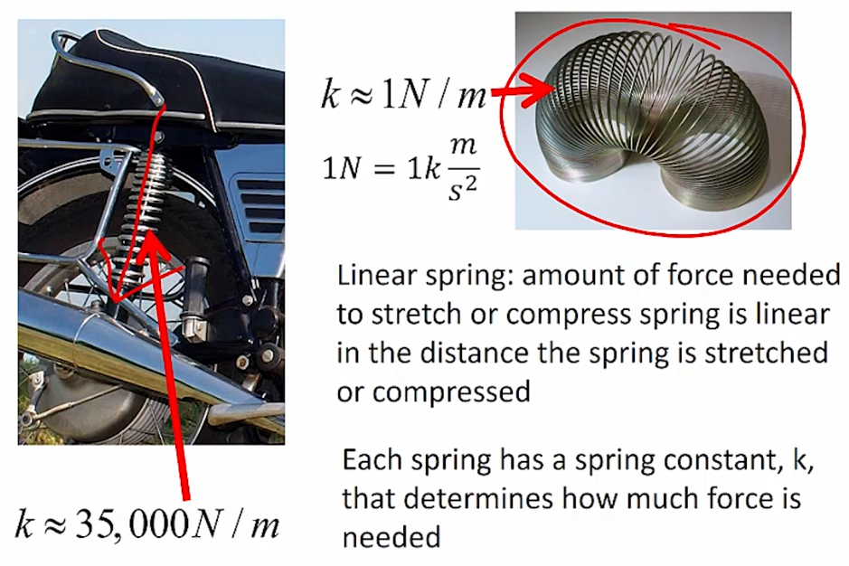

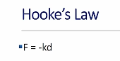

- notice that the force, `F`, is negative because the force exerted by the spring is in the opposite direction of the displacement
- if you compress the spring, it wants to expand; if you expand it, it wants to compress
- Hooke's law holds for a wide variety of materials and systems, but it does not hold for an arbitrarily large force
    - all springs have an elastic limit

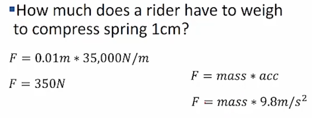

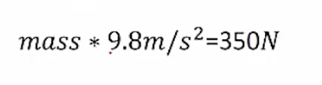

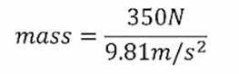

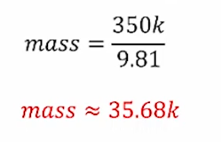

- the key to solving this is that we already knew what the spring constant was for this spring
- how do people go about finding spring constants?

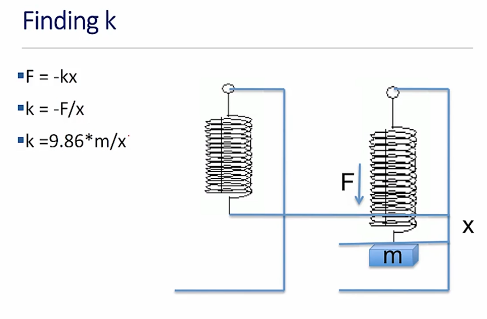

- a related experiment to the one shown above is to hang a series of increasingly heavy weights on a spring, measuring the stretch each time and plotting the results:

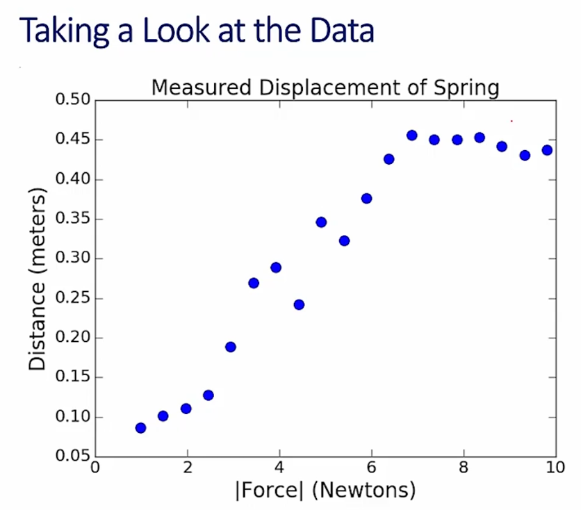

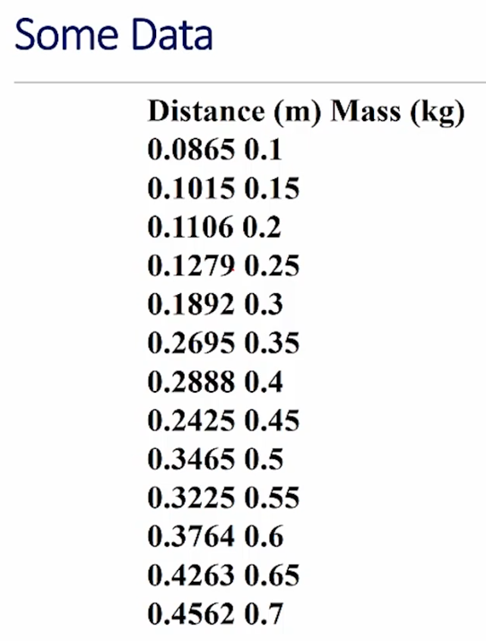

- Hooke's law tells us that these points *should* lie on a straight line with a slope determined by the spring constant
- but when we do experimentation, the data is effectively *never* a perfect match for the theory -- measurement error is to be expected
    - the points won't, then, lie *on* the line, but rather *around* the line
    - still, it would be nice to see a line that represents our best guess for where the points would have been had we no measurement error
        - the usual way to do this is to fit a line to the data
            - when we fit a curve to a set of data, we are finding a fit that relates an independent variable (the mass in the case of our experiment) to an estimated value of a dependent variable (distance the spring drops)

---
### Curve Fitting
---

- when we fit a curve to a set of data, we are finding a fit that relates an independent variable to an estimated value of a dependent variable
- in this case, we want to find a line such that some function of the sum of the distances from the line to the measured points is minimized
    - once we have such a function, finding the best fit can be formulated as finding a curve that minimizes the value of that function

- key issue is that we're looking for the sum of the distances
    - how do we measure that?
        - horizontally (x-axis)
        - vertically (y-axis)
        - shortest distance (perpendicular to line)
    - we use `y` in this case because our whole purpose in finding is to use it to predict the dependent `y`-value for a given independent `x`
        - this is an important thing to think about because whenever we're fitting a curve to data, we need to understand which variables are **independent** (i.e., we believe in them, they're measured), and which are **dependent** (the ones we're predicting)   

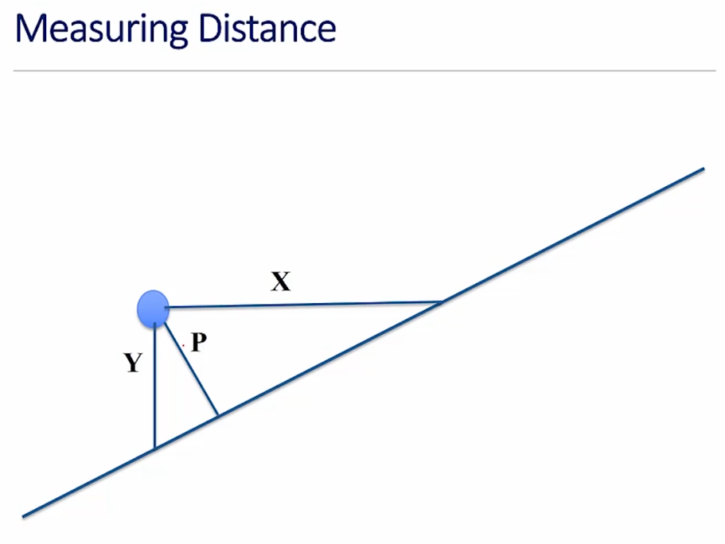

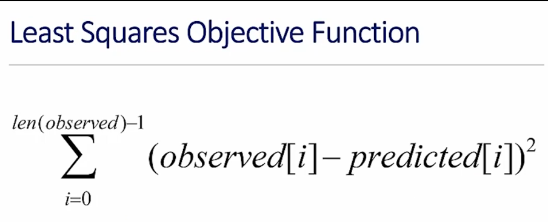

- let the *observed* and *predicted* be arrays of equal length, where observed contains the measured points -- the ones we actually measured in our experiment -- and predicted the corresponding data points from the proposed fit
- the difference between the observed and predicted is often called the **residual**
- notice that, by squaring the differences, we make the direction of the error irrelevant
- we could also accomplish making the direction irrelevant simply by taking the absolute value of the difference
    - doing it this way, however, has an important technical advantage that makes the optimization problem much easier to solve, as we'll see in a future segment

- does this formula look familiar?
    - it's simply the variance times the number of observations
        - if we minimize this, we're also minimizing the variance

- so how do we go about finding a curve that minimizes the objective function?

---

## 4.2 Fitting A Model To Data

- we ended last segment asking how we might go about finding the curve that minimizes the objective function we looked at (above)
- what we're going to do is use something called **linear regression** to find the coefficients of a polynomial

---
### Polynomials With 1 Variable (`x`)
---

- 0 or sum of finite number of non-zero terms
- each term of the form *cx*^*p*
    - *c*, the coefficient, a real number
    - *p*, the degree of the term, a non-negative integer
- the degree of the polynomial  is the largest degree of any term
- examples:
    - line: *ax*+*b*
    - parabola: *ax*^2 + *bx* + *c*

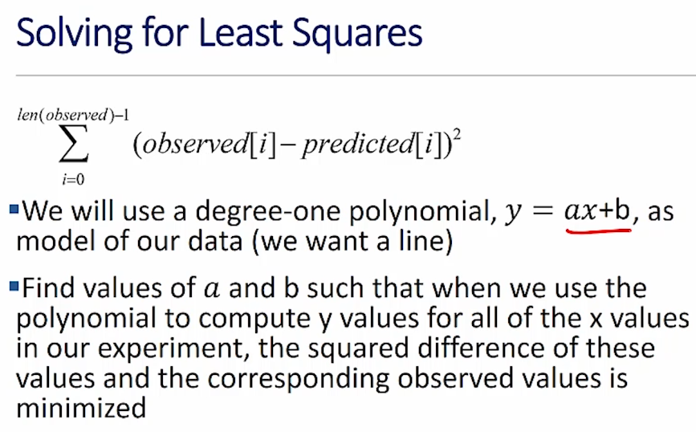

- a **linear regression** problem
- many algorithms for solving, including one similar to Newton's Method (shown in 6001x)

- however, there are efficient analytical solutions based on the fact that this objective function is **differentiable**
    - this is why we use the square as oppposed to the absolute value, as we mentioned in the last segment

---
### `polyfit`
---

- `pylab.polyfit(pbservedX, observedY, n)`
    - finds coefficient of a polynomial of degree *n*, that provides a best least squares fit for the observed data

---
### Using `polyfit`
---

```python
def fitData(fileName, toPrint=True):
    xVals, yVals = getData(fileName)
    xVals = pylab.array(xVals)
    yVals = pylab.array(yVals)
    xVals = xVals * 9.81
    pylab.plot(xVals, yVals, 'bo', label='Measured Points')
    labelPlot()

    a, b = pylab.polyfit(xVals, yVals, 1)
    estYVals = a * xVals + b
    if toPrint:
        print('a =', a, 'b =', b)

    pylab.plot(xVals, estYVals, 'r', label="Linear fit, k = ' + str(round(1/a, 5)))
    pylab.legend(loc='best')
```

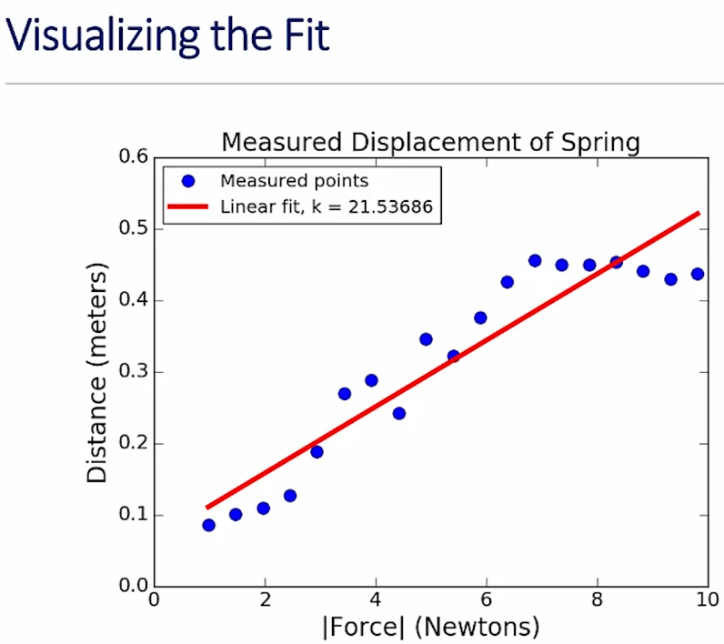

- red line tells us the expected values if the spring were truly linear
- also computes `k` as `1/a`
    - why `1/a`?
        - slope is delta distance divided by delta force
        - spring constant, `k`, is delta force divided by delta distance
            - therefore, `k` is the inverse of `a`

- we're trying to minimize the sum of the squared errors, not trying to maximize number of points that lie on the line

---
### Version Using `polyval`
---

```python
def fitData(fileName):
    xVal, yVals = getData(fileName)
    xVals = pylab.array(xVals)
    yVals = pylab.array(yVals)
    xVals = xVals * 9.81
    pylab.plot(xVals, yVals, 'bo', label='Measured Points')
    labelPlot()

    model = pylab.polyfit(xVals, yVals, 1)
    estYVals = pylab.polyval(model, xVals)

    pylab.plot(xVals, estYVals, 'r', label="Linear fit, k = ' + str(round(1/model[0], 5)))
    pylab.legend(loc='best')
```
- you can imagine, if the polynomial is of degree 10, this is going to be much easier to implement and read
- more importantly, using this formulation of assigning the result to a single variable and then using `polyval`, which makes the code independent of the degree of the polynomial
    - we can call the same code with polynomials of lots of different degrees
        - in the next segment, we'll see that this is highly useful

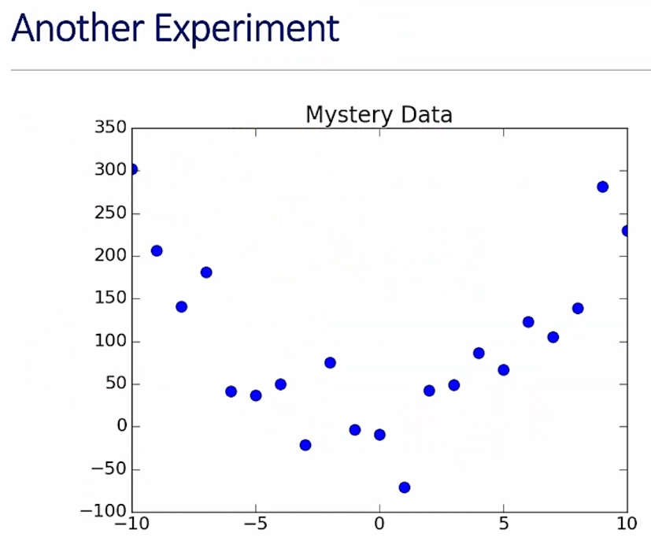

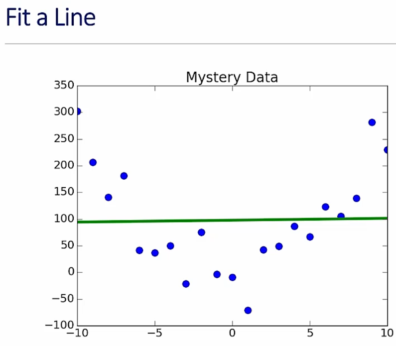

- this is what happens when we fit a curve to these points
    - does this do a very god job of describing the points?
        - certainly doesn't tell me what's going on here
- unsurprisingly, lots of experiments yield data that't not best explained by a line
        - 

---
### Let's Try A Higher Degree Polynomial
---

```python
model2 = pylab.polyfit(xVals, yVals, 2)
pylab.plot(xVals, pylab.polyval(model2, xVals), 'r--', label='Quadratic Model')
```

- even though this is quadratic and not a line, this is also an example of linear regression because we're still adding a sum of terms

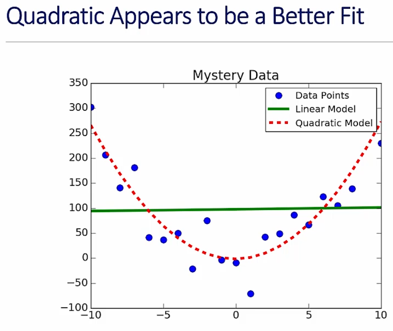

---

## 4.3 Goodness Of Fit

- we're going to look at two quantitative ways to talk about how much better the quadratic fit was compared to the line in the final example from the last segment
- how much better:
    - relative to each other
    - in an absolute sense

---
### Relative To Each Other
---

- fit is a function from the independent variable to the dependent variable
- given an independent value, provides an estimate of the dependent value
- which fit provides better estimates
    - mean square errors will tell us

---
### Comparing Mean Squared Error
---

```python
def  avMeanSquareError(data, predicted):
    error = 0.0
    for i in range(len(data)):
        error = error + (data[i] - predicted[i])**2
    return error / len(data)

estYVals = pylab.polyval(model1, xVals)
print('Av. mean square error for linear model =', \
        avMeanSquareError(yVals, estYVals))

estYVals = pylab.polyval(model2, xVals)
print('Av. mean square error for quadratic model =', \
        avMeanSquareError(yVals, estYVals))
```

- we need to divide by the length of the data because, if we were to have lots of data points, the error will look worse than if we have only a few data points
- the results of running this code on the examples is a ~9372 for linear model and, unsurprisingly much less, ~1524 for the quadratic model
    - so it looks like the quadratic model is about 6 times better a fit
        - so the question of relative goodness is pretty unambiguous
        - still, we have to ask if quadratic is a good fit in an absolute sense

---
### In An Absolute Sense
---

- mean square error useful for comparing two different models for the same data
- useful for getting a sense of absolute goodness of fit?
    - is 1524 good?
        - it's hard to know as there is no upper bound on how big it could be and it's not scale-dependent
    - instead, we use the **coefficient of determination**
        - usually written as R^2:

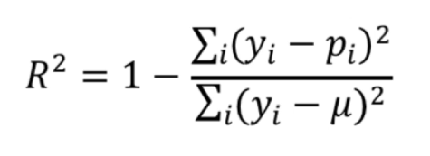

- y values are measured values
- p values are predicted values
- think of the numerator as the amount of error in the estimates
- think of denominator as capturing the variability in the estimates -- how much they differ from the mean
- 1 is a perfect score

---
### If You Prefer Code
---

```python
def rSquared(observed, predicted):
    error = ((predicted - observed)**2).sum()
    meanError = error / len(observed)
    return 1 - (meanError / numpy.var(observed))
```

---
### R^2
---

- by comparing the estimation errors (the numerator) with the variability of the original values (the denominator), R^2 is meant to capture the proportion of variability in a data set that is accounted for by the statistical model provided by the fit
- always between 0 and 1 when fit generated by a linear regression and tested on training data
    - we'll see that this does not hold for the so-called "out-of-sample data" that we didn't train it on
- if R^2=1, the model explains all of the variability in the data
- if R^2=0, there is no relationship between the values predicted by the model and the actual data
- if R^2=0.5, the model explains half the variability in the data

---
### Testing Goodness Of Fits
---

```python
def genFits(xVals, yVals, degrees):
    models = []
    for d in degrees:
        model = pylab.polyfit(xVals, yVals, d)
        models.append(model)
    return models

    def testFits(models, degrees, xVals, yVals, title):
        pylab.plot(xVals, yVals, 'o', label='Data')
        for i in range(len(models)):
            estYVals = pylab.polyval(models[i], xVals)
            error = rSquared(yVals, estYVals)
            pylab.plot(xVals, estYVals, label='Fit of degree ' + \
                        str(degrees[i]) + \
                        ', R2 = ' + str(round(error, 5)))
            pylab.legend(loc='best')
            pylab.title(title)
```

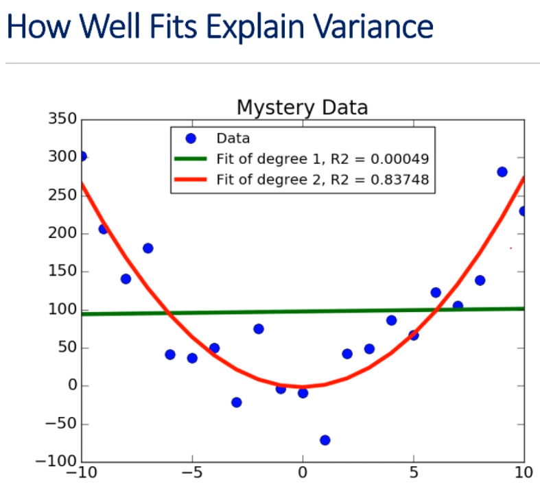

- quadratic fit explains almost 84% of the variability
    - pretty, pretty good!
    - can a higher degree polynomial give us a better fit, though?

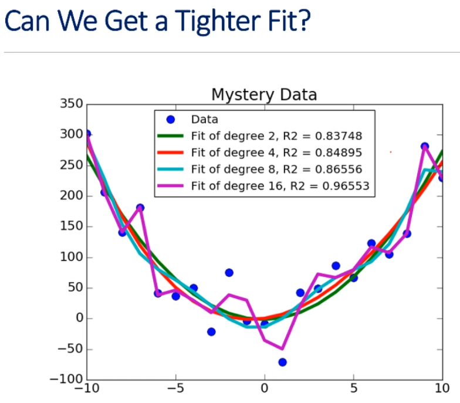

- the degree 16 polynomial explains over 90% of the variability, and we see it steadily improves up to that
    - so we know we can get a better fit using a higher degree polynomial, but just because we can doesn't mean we should

---