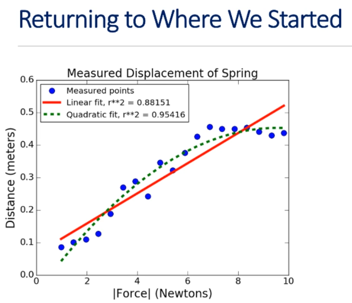

# Unit 4: Understanding Experimental Data

# Lecture 11: Experimental Data Pt. 2

## 4.4 Fits For Datasets

- ended the last lecture looking at mystery data, showing that moving from a quadratic fit to to a fit using a polynomial of 16 degrees dramatically improved the R^2 of our model
- to understand what we should and shouldn't do a bit better, however, we need to ask ourselves why we built the model in the first place
    - why do we build models?
    - what's the whole point of this enterprise?

---
### Why We Build Models
---

- help us understand the process that generated the data
    - e.g., the properties of a particular linear spring
- help us make predictions about out-of-sample data 
    - e.g. predict the displacement of a spring when a force is applied to it
    - e.g., predict the effect of a treatment on a patient
    - that is to say, data that we have never seen -- data we didn't use to build the model
- a model helps us do these things

---
### How Mystery Data Was Generated
---

```python
def genNoisyParabolicData(a, b, c, xVals, fName):
    yVals = []
    for x in xVals:
        threoreticalVal = a*x**2 + b*x + c
        yVals.append(theoreticalVal + random.gauss(3, 35))

    f = open(fname, 'w')
    f.write('x        y\n)
    for i in range(len(yVals)):
        f.write(str(yVals[i]) + ' ' + str(xVals[i]) + '\n')
    f.close()

# parameters for generating data
xVals = range(-10, 11, 1)
a, b, c = 3, 0, 0
genNoisyParabolicData(a, b, c, xVals, 'Mystery Data.txt')
```

- gets the theoretical value and then adds some Gaussian noise to each point by choosing a value with a mean of 0 and a standard deviation of 1 from a Gaussian distribution, subsequently writing out those points

---
### Let's Look At Two Data Sets
---

```python
degrees = (2, 4, 8, 16)

random.seed(0)
xVals1, yVals1 = getData('Dataset 1.txt')
models1 = genFits(xVals1, yVals1, degrees)
testFits(models1, degrees, xVals1, yVals1, 'Dataset 1.txt')

pylab.figure()
random.seed(0)
xVals2, yVals2 = getData('Dataset 2.txt')
models2 = genFits(xVals2, yVals2, degrees)
testFits(models2, degrees, xVals2, yVals2, 'Dataset 2.txt')
```


- so why are the 16 degree polynomials the winners when we know that process is pretty much parabolic?
    - there's no reason to think it's a degree 16 process
    - we have to keep in mind here that we're looking at **training error**

---
### Hence Degree 16 Is Tightest Fit
---

- what we are looking at is training error
- how well the model performs on the data from which it was learned
- small training error a necessary condition for a great model, but not a sufficient one
- we want to model the work well on other, i.e. out-of-sample, data generated by the same process
    - measurements for other weights on the spring
    - voters other than those surveyed
    - etc.
- i.e., it needs to generalize

---
### Cross Validate
---

- generate models using one dataset, and then test it on other
    - use models for `Dataset 1` to predict points for `Dataset 2`
    - use models for `Dataset 2` to predict points for `Dataset 1`
- expect testing error to be larger than training error
- a better indication of generalizability than training error

---
### Test Code
---

```python
pylab.figure()
testFits(models1, degrees, xVals2, yVals2, 'Dataset 2/Model 1')
pylab.figure()
testFits(models2, degrees, xVals1, yVals1, 'Dataset1/Model 2')
```


- degree 16 fit is pretty lousy when cross-validating
    - why is this?

---

## 4.5 Model Predictions And Overfitting


- we left off looking at these two plots and observing that, while the order 16 polynomial fits had a greater R^2 in the training data, they also did the worst on the test data
    - now we'll talk about why

---
### Increasing The Complexity
---

- what happens when we increase order of polynomial?
    - can we get a worse fit to training data?
        - not really...
- if extra term is useless, coefficient will merely be zero
- but if data is noisy, can fit the noise rather than the underlying pattern in the data
    - and this is a pretty intuitive conclusion, no?
    - the higher the degree of the polynomial, the more likely it is to fit the noise

---
### Fitting A Quadratic To A Perfect Line
---

```python
xVals = (0,1,2,3)
yVals = xVals
pylab.plot(xVals, yVals, label='Actual values')
a, b, c = pylab.polyfit(xVals, yVals, 2)

print('a =', round(a, 4), 'b =', round(b, 4), 'c =', round(c, 4))
estYVals = pylab.polyval((a, b, c), xVals)
pylab.plot(xVals, estYVals, 'r--', label='Predictive values')

print('R-squared =', rSquared(yVals, estYVals))
```

- creates and plots a line with a y-intercept of 0 and a slope of 1


---
### Predict Another Point Using Same Model
---

```python
xVals = xVals + (20,)
yVals = xVals
pylab.plot(xVals, yVals, label='Actual value')
estYVals = pylab.polyval((a,b,c), xVals)
pylab.plot(xVals, estYVals, 'r--', label='Predictive values')
print('R-squared =', rSquared(yVals, estYVals))
```

---
### Simulate A Small Measurement Error
---

```python
xVals = (0, 1, 2, 3)
yVals = (0, 1, 2, 3.1)
pylab.plot(xVals, yVals, label='Actual values')
model = pylab.polyfit(xVals, yVals, 2)
print(model)
estYVals = pylab.polyval(model, xVals)
pylab.plot(xVals, estYVals, 'r--', label='Predicted values')
print('R-sqaured =', rSquared(yVals, estYVals))
```

---
### Predict Another Point Using Same Model
---

```python
xVals = xVals + (20,)
yVals = xVals
estYVals = pylab.polyval(model, xVals)
print('R-squared =', rSquared(yVals, estYVals))
pylab.figure()
pylab.plot(xVals, estYVals)
```

- there gets to be a bigger and bigger gap between actual and predicted values when using this model

---
### Suppose We Had Used A First Degree Fit
---

```python
model = pylab.polyfit(xVals, yVals, 1)
```


- the actual and predicted values aren't quite the same
    - they still diverge as we get further out, but by way less

---
### The Take-Home Message
---

- choosing an overly-complex model leads to **overfitting** to the training data
- increases the risk of a model that works poorly on data not included in the training set
- on the other hand, choosing an insufficient complexity for the model has other problems
    - as we saw, when we fit a line to data that was basically parabolic

---

## 4.6 Cross-Validation

- ended the last segment talking about the importance of choosing the right degree polynomial when fitting a curve
    - "Everything should be made as simple as possible, but not simpler."

---
### Returning To Where We Started
---



- as you can see just by looking at it, the quadratic fit is much closer to these blue points, the measured points in a linear fit
    - indeed, that difference is clearly indicated by the respective R^2 values -- 0.95 is clearly better than 0.88
        - does that mean the quadratic fit is better?
        - probably wouldn't have asked the question if the answer weren't no
    - quadratic fit may be tighter, but remember our whole motivation for fitting a curve in the first place was that we wanted to estimate the spring constant using Hooke's law, which asserts that the relation between force and distance is linear
        - theory should guide us here

- also notice how the data from distance 6 to 10 is *not* changing linearly with the force
    - recall that Hooke's law states that the relation between force and distance is linear up to the elastic limit of the spring
        - probably what has happened here is that we've gone beyond the elastic limit on the right side of the plot
- what we *should* have done is fit two curves to the data, one to each set of points before and after that elastic limit
    - then we're getting a model of what the spring does before it reaches its elastic limit, and another curve to get a model of what it does after it reaches elastic limit
        - we could then look at the R^2 for each fit separately

> if we have a theory about the system that generated the data, we can use that theory to choose the degree of the model

---
### Suppose We Don't Have A Solid Theory
---

- use cross-validation results to guide the choice of model complexity
- if dataset is small, use leave one-one-out cross validation
- if dataset is large enough, use k-fold cross validation or repeated random sampling validation

---
### Leave-One-Out Cross Validation
---

```python
"""Let D be the original dataset"""

testResults = []
for i in range(len(D)):
    training = D[:].pop(i)
    model = buildModel(training)
    testResults.append(test(model, D[i]))

"""Average testResults"""
```

- leave out one example, train on all of the other examples, and then test in the example we left out
    - do this until each example has been left out
        - average the test results
- could do this for polynomials of many different degrees and see which degree gave us the best average test result
    - that could be used to choose the right level of complexity for the model
- wouldn't want to do this if we have millions of training examples -- would take way too long

- K-fold is very similar
    - D partitioned into k equal size sets
    - model trained on k-1, and tested on remaining

---
### Repeated Random Sampling
---

```python
"""Let D be the original dataset
        n be the number of random samples"""

testResult = []
for i in range(n):
    """randomly partition D into two sets: training and test"""
    model = buildModel(training)
    testResults.append(test(model, test))

"""Average test results"""
```

---
### An Example: Temperature By Year
---

- task: model how the mean daily high temperature in the U.S. varied from 1961 through 2015
- get means for each year and plot them
    - it's always a good idea to start with a visualization of the raw data to make sure that something weird isn't going on 

- randomly divide in half *n* times
    - for each dimensionality to be tried:
        - train on one half of data
        - test on other half
        - record R^2 on test data
- report mean R^2 for each dimensionality

---
### A Boring Class
---

```python
class tempDatum(object):
    def __init__(self, s):
        info = s.split(',')
        self.high = float(info[1])
        self.year = int(info[2][0:4])
    def getHigh(self):
        return self.high
    def getYear(self):
        return self.year
```

---
### Read Data
---

```python
def getTempData():
    inFile = open('temperatures.csv')
    data = []
    for l in inFile:
        data.append(tempDatum(l))
    return data
```

---
### Get Means
---

```python
def getYearlyMeans(data):
    years = {}
    for d in data:
        try:
            years[d.getYear()].append(d,getHigh())
        except:
            years[d.getYear()] = [d.getHigh()]
    for y in years:
        years[y] = sum(years[y]) / len(years[y])
    return years
```

---
### Get And Plot Data
---

```python
data = getTempData()
years = getYearlyMeans(data)
xVals, yVals = [], []
for e in years:
    xVals.append(e)
    yVals.append(years[e])
pylab.plot(xVals, yVals)
pylab.xlabel('Year')
pylab.ylabel('Mean Daily High (C)')
pylab.title('Select U.S. Cities')
```


- let's use cross validation to find out how to model this

---
### Initialize Things
---

```python
numSubsets = 10
dimensions = (1, 2, 3)
rSquares = {}
for d in dimensions:
    rSquares[d] = []
```

---
### Split Data
---

```python
def splitData(xVals, yVals):
    toTrain = random.sample(range(len(xVals)), len(xVals) // 2)
    trainX, trainY, testX, testY  = [], [], [], []
    for i in range(len(xVals)):
        if i in toTrain:
            trainX.append(xVals[i])
            trainY.append(yVals[i])
        else:
            testX.append(xVals[i])
            testY.append(yVals[i])
    return trainX, trainY, testX, testY
```

- notice that we're sampling here is not the elements themeselves, but the indices
    - we want to make sure that the x and y values line up with each other

---
### Train, Test, And Report
---

```python
for f in range(numSubsets):
    trainX, trainY, testX, testY = splitData(xVals, yVals)
    for d in dimensions:
        model = pylab.polyfit(trainX, trainY, d)
        estYVals = pylab.polyval(model, testX)
        rSquares[d].append(rSquared(testY, estYVals))

print('Mean R-squares for test data')
for d in dimensions:
    mean = round(sum(rSquares[d]) / len(rSquares[d]), 4)
    sd = round(numpy.std(rSquares[d]), 4)
    print('For dimensionality', d, 'mean =', mean, 'Std =', sd)
```


- line dimensionality 1 seems to be the winner
    - best R^2 and best mean R^2
    - also the simplest model

- notice we also computed and printed the standard deviations
    - roughly a decimal order of magnitude smaller than the means, not terribly large
        - but it's large enough to suggest that it's a good thing that we used more than one split
        if we'd only run one trial, this suggests we might have gotten a deceptive result

---
### Wrapping Up Curve Fitting
---

- we can use linear regression to fit a curve to data
    - mapping from independent values to dependent values
- that curve is a model of the data that can be used to predict the value associated with independent values we haven't seen (out-of-sample data)
- R-squared used to evaluate model
    - higher not always better because of the risk of overfitting
- choose complexity of model based on:
    - theory about structure of data
    - cross validation
    - simplicity
    
---