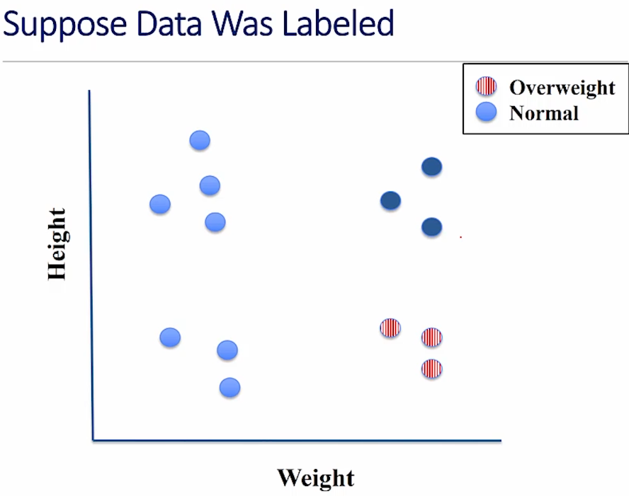

# Unit 5: A Tiny Taste Of Machine Learning

# Lecture 12: Machine Learning

## 5.1 What Is Machine Learning

- machine learning is probably the hottest topic in modern computer science
    - has made a lot of people a lot of money and drives a lot of modern technology

- speech recognition is based on machine learning
- automatic reading of medical images
- it's beginning to drive our cars

---
### What Is Machine Learing?
---

- many useful programs learn something
- in the last two lectures of 6002x, we used linear regression to learn models of data
- "Field of study that gives computers the ability to learn without being explicitly programmed" - Arthur Samuel (American electrical engineer and computer scientist famous for checker-playing program)


- put the data and the output data associated with that data into the computer, and get a program out on the other end
    - can then feed new data into that program, and it will produce the output that it thinks should be associated with that data
    - this is exactly what we did in our curve-fitting exercises
        - put in independent values, the dependent values, the input and the output
        - we learned the model, and then we could use that model to make **predictions**

---
### How Are Things Learned?
---

- memorization
    - accumulation of individual facts
    - limited by:
        - time to obeserve facts
        - memory to store facts
            - rather limited
- generalization
    - deduce facts from old facts
    - limited by accuracy of deduction process
        - essentially a predictive activity
        - assumes that past predicts the future

---
### Basic Paradigm
---

- observe set of examples: **training data**
- infer something about process that generated that data
- use inference to make predictions about previously unseen data: **test data**

---
### All ML Methods Require:
---

- lots of different ways to do machine learning:
    - ranging from old warhorses such as regression and k-means clustering to more modern techniques still undergoing rapid development, like deep learning

- all approaches to machine learning have some things in common:
    - representation of the features
        - descriptions of our examples
            - typically represent these as a vector of values called a **feature vector**
    - distance metric for feature vectors
    - objective functions and constraints
    - optimization method for learning the model
    - evaluation method
        - to evaluate the models that the optimization method finds
        - we need this for two reasons:
            1. need to know whether we should put any faith in the model
            2. tune the parameters of the learning method

- in our example, we had only one parameter for linear regression, the degree of the polynomial, but many of the more modern learning methods have lots of parameters
    - how we tune those parameters, how we choose those parameters, ends up being very important
- broadly speaking, machine learning can be classified as either supervised or unsupervised learning

---
### Supervised Learning
---

- start with a set of feature vector/value pairs -- the value associated with the feature vector
- goal: to find a model that predicts a value for a previously unseen feature vector
- **regression models** predict a real number
    - as with linear regression
- **classification models** predict a label (chosen from a *finite* set of labels)

---
### Unsupervised Learning
---

- start with a set of feature vectors
- goal: uncover some latent structure in the set of feature vectors
- **clustering** the most common technique
    - define some metric that captures how similar one feature vector is to another
    - group examples based on this metric

let's look at this pictorially:  


- you could very well see four clusters here
- if you consider only weight, there are then two clusters on the left and right
- if you consider only height, there are then two clusters on top and one bottom

- depending on what you use as your features, different structure emerges from the data
    - so you have to choose the features and then the distance metrics



---
### Choosing Features
---

- features never fully describe the situation
- feature engineering:
    - find features that are pertinent to the task
    - represent examples by feature vectors that will facilitate generalization
    - suppose I want to use 100 examples from the past to predict which students will pass the final exam
        - some features surely helpful, e.g., their grade on the midterm, did they do the problem sets, etc.
        - others might cause me to overfit, e.g., birth month
- want to maximize ratio of useful input to irrelevant input
    - **Signal-to-noise ratio** (SNR)
        - the *signal* is information that's pertinent to the task at hand
        - noise is everything else
        - we want the signal to be as large as possible relative to the noise

---

## 5.2 K-Nearest Neighbors


- to get from one point to another in Manhattan, you have to actually follow the base and height of a triangle, since there are large buildings that make it impossible to take the hypotenuse

- using Euclidean distance, the cross is closer
- using Manhattan distance, the star is closer
- so what's the right metric?
    - there's no answer to that, it just depends on the application

- for the moment, we'll stick to Euclidean distance in an example of supervised learning


---
### Producing The Distance Matrix
---

```python
columnLabels = []
for a in animals:
    columnLabels.append(a.getName())
rowLabels = columnLabels[:]
tableVals = []

# Get distances between pairs of animals
# For each row
for a1 in animals:
    row = []

    # For each column
    for a2 in animals:
        if a1 == a2:
            row.append('--')
        else:
            distance = a1.distance(a2)
            row.append(str(round(distance, precision)))
    tableVals.append(row)
```

- what we're doing first is producing the labels for the rows and labels for the columns
    - they happen to be the same in this case
- then we compute the value of each cell
- then for each column, if I'm comparing an animal to itself, we put a dash (or 0); otherwise, we just call the animal cluster to get the distance between two animals and append it to the row list
- when we're done with a row, append the row to a list of `tableVals`

---
### Producing The Table
---

```python
# Produce table
table = pylab.table(rowLabels=rowLabels, \
                    colLabels=columnLabels, \
                    cellText=tableVals, \
                    cellLoc='center', \
                    loc='center', \
                    colWidths=[0.138]*len(animals))
table.auto_set_font_size(False)
table.set_fontsize(10)
table.scale(1, 2.5)
pylab.axis('off')
pylab.savefig('distances')
```


---
### Advantages And Disadvantages Of KNN
---

- advantages
    - learning fast, no explicit training
    - no theory required
    - easy to explain method and results

- disadvantage
    - memory intensive, predictions can take a long time
    - are better algorithms than brute force
    - no model to shed light on process that generated data

- another method, logistic regression, covered in textbook


- the number of legs is getting disproportionate weight because it happens to have bigger numbers
- have to change that feature vector to "has legs"

- in this case, converting *all* the features to binary did the trick, but this is not always the best way to deal with numerical features
    - more often, we want to retain some information about the relative values across the features across examples

- imagine we go back to the weather example we've looked at before -- there's a big difference between two temperatures being 40 degrees apart and being two degrees apart
    - we wouldn't want to convert everything to cold or warm, we really do need to maintain some values

---
### A More General Approach: Scaling
---

- Z-scaling
    - each feature has a mean of 0 and a standard deviation of 1
- interpolation
    - map minimum value to 0, max value to 1, and linearly interpolate

```python
def zScaleFeatures(vals):
    """
    Assumes vals is a sequence of floats
    """
    result = pylab.array(vals)
    mean = float(sum(result)) / len(result)
    result = result - mean
    return result / stdDev(result)

def iScaleFeatures(vals):
    """
    Assumes vals is a sequence of floats
    """
    minVal, maxVal = min(vals), max(vals)
    fit = pylab.polyfit([minVal, maxVal], [0, 1], 1)
    return pylab.polyval(fit, vals)
```

---

## 5.3 Clustering

- partition examples into groups (clusters) such that examples in a group are more similar to each other than to examples in other groups
- unlike classification, there is not typically a "right" answer
    - answer dictated by feature vector and distance metric, not by a ground truth label

- when we cluster data, the answer we get is dictated by the features we choose to use and  the distance metric we use to compare the resultant feature vectors


- why not divide variability by the size of the cluster?
    - big and bad worse than small and bad
- is the optimization problem finding a *C* that minimizes *dissimilarity(C)*?
    - no, otherwise could put each example in its own cluster
    - need a constraint
        - e.g., minimum between clusters and number of clusters

---
### K-Means Clustering
---

- constraint: exactly *k* non-empty clusters
- use a greedy algo to find an approximation to minimizing the objective function

```python
"""randomly chose k examples as initial centroids"""
while true:
    """create k clusters by assigning each example to closest centroid"""

    """compute k new centroids by averaging examples in each cluster"""

    """if centroids don't change:"""
        break
```

- centroid is a geographical center of a cluster
- initially, we don't have any clusters
    - just going to choose at random *k* examples, calling them centroids, and then create *k* clusters by assigning each of the examples to the closest centroid
    - once we've done that, we'll compute *k* new centroids by averaging the examples in each cluster
        - if when we've dont that, we haven't moved the centroids, the algorithm converges and we're done
            - otherwise, if the centroid are not where they used to be, we come back and we repeat the process

---
### Mitigating Dependence On Initial Centroids
---

```python
best = kMeans(points)
for t in range(numTrials):
    C = kMeans(points)
    if dissimilarity(C) < dissimilarity(best):
        best = C
return best
```

---
### A Pretty Example
---

- use k-means to cluster groups of pixels in an image by their color
    - get the color associated with the centroid of each cluster, i.e., the average color of the cluster
    - for each pixel in the image, find the centroid that is its nearest neighbor
    - replaced the pixel by that centroid

---
### Wrapping Up Machine Learning
---

- use data to build statistical models that can be used to:
    - shed light on system that produced data 
    - make predictions about unseen data
- supervised learning
- unsupervised learning
- feature engineering
- goal was to expose you to some important ideas
    - not to get you to the point where you could apply them
        - much more detail, including implementations, in text

---