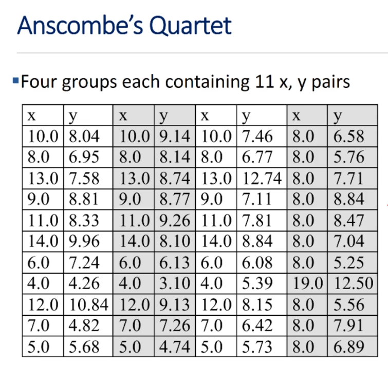
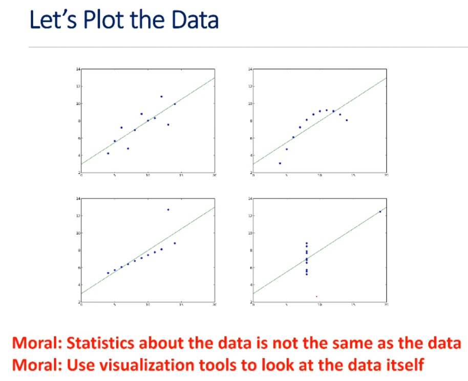
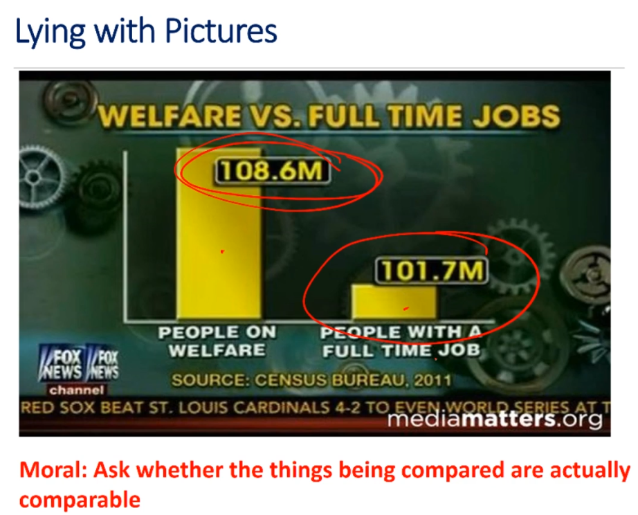
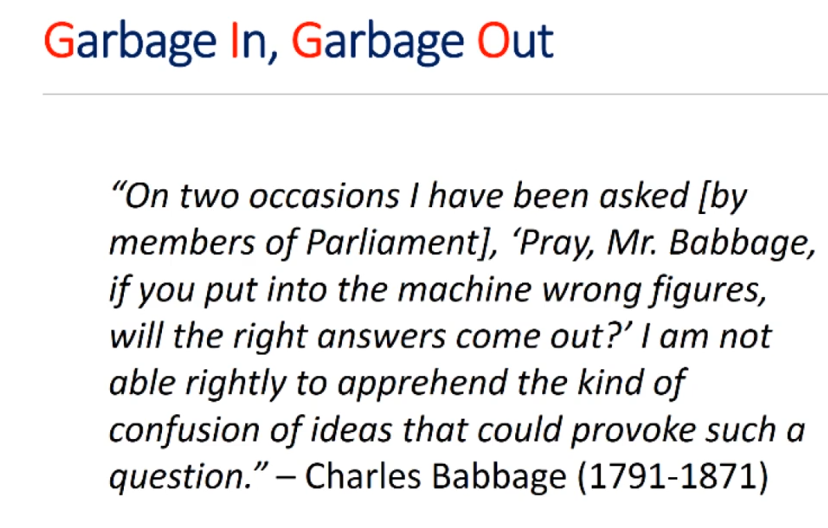
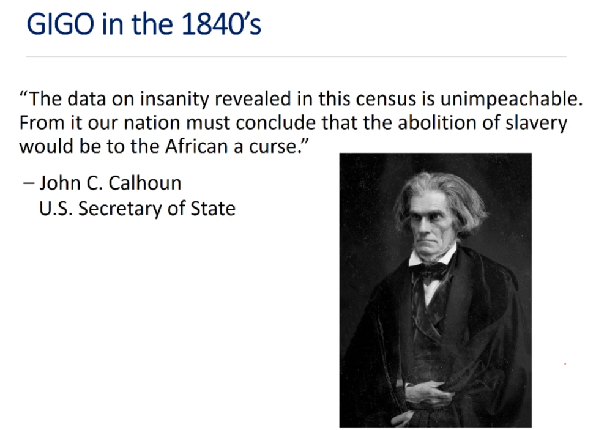
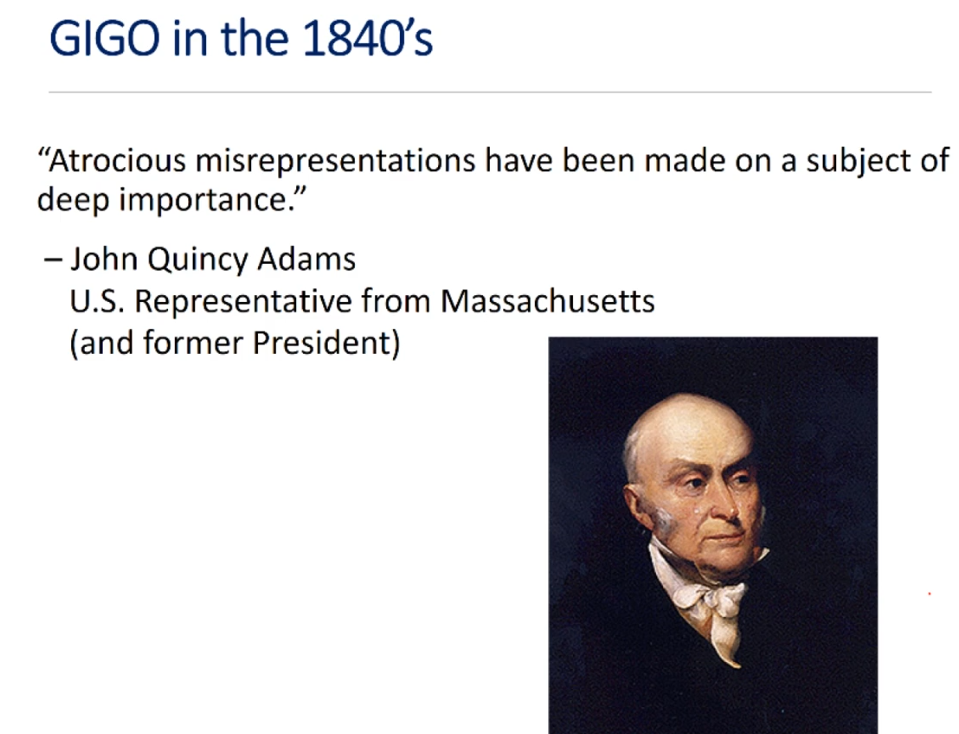

# Unit 5: A Tiny Taste Of Machine Learning

# Lecture 13: Statistical Fallacies

## 5.4 Lies, Damned Lies, And Statistics

"If you can't prove what you want to prove, demonstrate something else and pretend they are the same thing.  In the daze that follows the collision of statistics with the human mind, hardly anyone will notice the difference."  
-- Darrel Huff  

---
### Summary Statistics
---

- summary statistics for groups identical
    - mean x = 9.0
    - mean y = 7.5
    - variance of x = 10.0
    - variance of y = 3.75
    - linear regression model: y = 0.5x + 3
- same for each

- **Moral**: look carefully at axes labels and scales

---
### GIGO
---

- garbage in, garbage out

---
### Calhoun's Response To Errors In Data
---

- "there were so many errors they balanced one another, and led to the same conclusion as if they were all correct."

> was it the case that the measurement errors are unbiased and independent of each other, and therefore almost identically distributed on either side of the mean?

- no, later analysis showed that the errors were not random but systematic
- "it was the census that was insane and not the colored people." -- James Freeman Clarke

- **Moral**: analysis of bad data can lead to dangerous conclusions

---

## 5.5 Texas Sharpshooter

---

## 5.6 Correlation And Causation

---